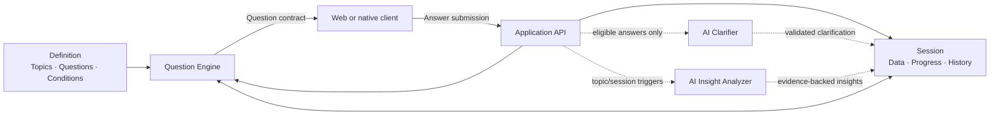
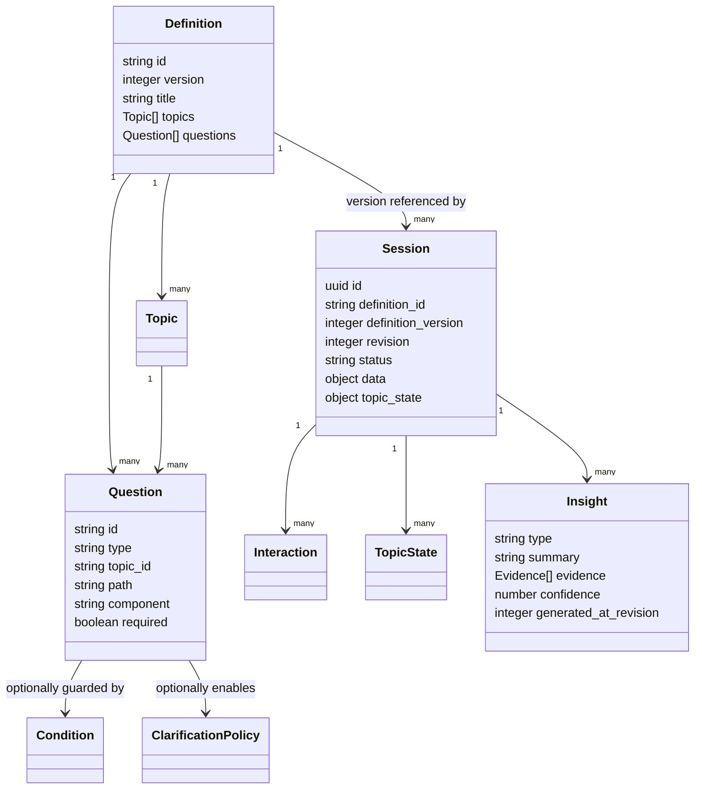
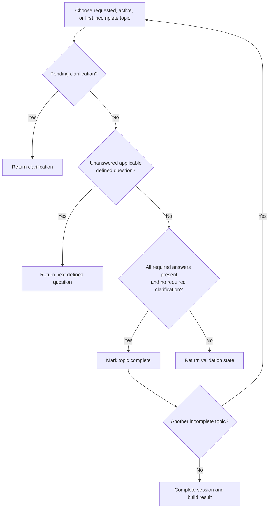
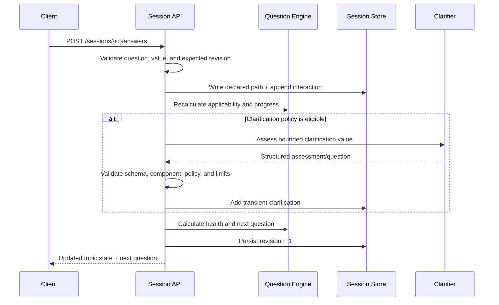
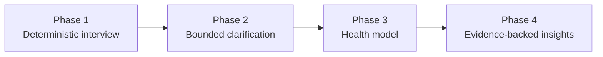

# Qavai — Topic-Driven Adaptive Interview Engine

> A definition-driven consultation engine that combines a deterministic interview path with bounded AI clarification and evidence-backed analysis.

## The idea

Most forms force people through a fixed sequence of fields. Most AI interviews do the opposite: they are flexible, but unpredictable and difficult to validate.

Qava sits between those approaches. It should feel like navigating a structured consultation:

- people see the available topics before answering anything;
- they can start at the beginning, resume, or open a specific topic;
- predefined questions establish a deterministic collection path;
- AI can briefly leave that path to clarify an answer;
- the engine always returns to the predefined path afterward;
- completion is decided by rules, never by AI opinion;
- the final result is structured, versioned, and suitable for later analysis.

The essential loop is deliberately small:

```text
Definition + Session  → Next Question
Question + Answer     → Updated Session
Updated Session       → Health + Next Question
```

A home-building consultation is the initial sample domain, not a constraint of the engine. The same runtime should support employee onboarding, risk assessments, discovery interviews, inspections, applications, and other structured conversations by loading a different definition.

---

## Product principles

1. **The definition is immutable.** A session always references a specific definition version.
2. **The session is separate.** Expected output and evolving knowledge are never stored together.
3. **Topics are first-class.** They drive navigation, progress, completion, health, and analysis.
4. **Determinism owns completion.** Required applicable questions and required clarifications decide when a topic is complete.
5. **AI is bounded.** It may clarify and analyze, but cannot alter the definition, skip required questions, invent topics, or declare completion.
6. **Every answer advances the revision.** This enables optimistic concurrency and reproducible analysis.
7. **Insights require provenance.** Every generated conclusion points to the paths that support it.
8. **The client renders contracts.** It does not contain interview business logic.

## Repository data pack

The proposal is now represented as implementation-leading, machine-readable files rather than one monolithic example. The canonical layout is documented in [`docs/data-layout.md`](docs/data-layout.md):

```text
data/
├── contracts/v1/                         # Stable, domain-neutral JSON Schemas
├── components/catalog.v1.json            # Declarative renderer vocabulary
├── definitions/custom-home-intake/v1/    # One immutable sample domain version
│   ├── definition.json                   # Bundle manifest
│   ├── topics.json                       # Navigation and ordering
│   └── questions/                        # One deterministic queue per topic
└── examples/custom-home-intake/           # Non-authoritative runtime examples
```

The custom-home pack demonstrates all eight representative topics and the important interaction shapes, but the reusable contracts and component catalog contain no home-building semantics. Definitions are authored as source data; sessions, interactions, generated questions, and insights are runtime records and must never be written back into a published definition.

Start with [`data/definitions/custom-home-intake/v1/definition.json`](data/definitions/custom-home-intake/v1/definition.json), then load its referenced topic and question files. Validate the assembled bundle against the schemas in [`data/contracts/v1`](data/contracts/v1) and validate every component name against [`data/components/catalog.v1.json`](data/components/catalog.v1.json).

## Conceptual architecture



### Clear ownership boundaries

| Layer | Owns | Must not own |
|---|---|---|
| Definition | Topics, questions, answer shapes, conditions, component hints, completion requirements | Session answers or generated clarifications |
| Session | Answers, active location, topic state, interactions, health, insights, revision | Definition changes |
| Question engine | Applicability, ordering, navigation, deterministic completion | Domain-specific knowledge or unrestricted generation |
| AI clarifier | Assessment and one schema-constrained follow-up | Skipping questions, writing answers, or marking completion |
| Insight analyzer | Answer, topic, and cross-topic observations with evidence | Unsupported conclusions or definition mutation |
| Client | Topic menu and declared question components | Applicability, completion, or AI policy |

---

## Core entities



### Definition

The definition describes the expected shape of a complete interview. It contains topics, predefined questions, conditions, expected answer shapes, completion requirements, clarification policies, and UX component hints.

```json
{
  "id": "custom-home-intake",
  "version": 1,
  "title": "Custom Home Planning",
  "topics": [
    {
      "id": "budget",
      "title": "Budget",
      "description": "Investment, financing, priorities, and contingencies",
      "order": 30,
      "required": true
    }
  ],
  "questions": [
    {
      "id": "budget-target-range",
      "topic_id": "budget",
      "path": "budget.target_range",
      "prompt": "What total project budget are you considering?",
      "component": "money_range",
      "required": true,
      "props": {
        "currencies": ["CAD", "USD"],
        "allow_unknown": true
      }
    }
  ]
}
```

Definitions are immutable after publication. Changes create a new version so old sessions remain explainable and replayable.

### Session

The session represents the current understanding for one interview. It contains current answers, topic progress, pending clarifications, interaction history, health, insights, and the active location.

```json
{
  "id": "session-123",
  "definition_id": "custom-home-intake",
  "definition_version": 1,
  "revision": 18,
  "status": "active",
  "active_topic_id": "budget",
  "data": {},
  "topic_state": {},
  "health": {},
  "insights": []
}
```

### Topic

A topic is a deterministic collection goal rather than a visual label. Each defined question belongs to exactly one primary topic. Topics provide a stable unit for navigation, progress, health, completion, and analysis.

Example home-building topics:

```text
Your Home
├── Vision
├── Property
├── Budget
├── Rooms & Spaces
├── Style & Character
├── Outdoor Living
└── Timeline & Delivery
```

### Question

All interactions share one contract, whether they are predefined, conditional, generated clarifications, or confirmations.

```json
{
  "id": "bedroom-count",
  "type": "defined",
  "topic_id": "rooms",
  "path": "rooms.bedrooms.count",
  "prompt": "How many bedrooms should the home have?",
  "component": "number",
  "required": true,
  "props": { "minimum": 1, "maximum": 12 }
}
```

A conditional question remains deterministic; only its applicability changes:

```json
{
  "id": "home-office-details",
  "type": "conditional",
  "topic_id": "rooms",
  "path": "rooms.home_office",
  "prompt": "What should the home office support?",
  "component": "multi_select",
  "required": true,
  "when": {
    "path": "rooms.special_spaces",
    "contains": "home_office"
  },
  "props": {
    "options": ["Video calls", "Two workstations", "Client meetings", "Built-in storage"]
  }
}
```

---

## Deterministic question flow

Every topic has an ordered queue of currently applicable defined questions. AI may insert a clarification, but it cannot remove or reorder the required deterministic destination.



The ordering remains unsurprising:

```text
Defined Q1
Defined Q2
Clarification A  ← temporary insertion
Clarification B  ← bounded by policy
Defined Q3       ← deterministic path resumes
Defined Q4
Topic complete
```

### Completion rule

A topic is complete when and only when:

```text
all applicable required defined questions are answered
AND
no required clarification is pending
```

Health does not block completion in the initial product. A topic can be **complete but weak**, which is useful information rather than an invalid state.

### Recalculating conditions

Applicability is recalculated after every answer. If an earlier answer changes and makes a question irrelevant, its old answer should no longer appear in current session data. It remains in interaction history for audit and replay.

---

## Answer processing

One answer request should update the authoritative session and return the next interaction.



Example submission:

```json
{
  "question_id": "budget-target-range",
  "expected_revision": 17,
  "value": {
    "minimum": 700000,
    "maximum": 900000,
    "currency": "CAD"
  }
}
```

Every accepted answer writes only to the question's declared path, appends an interaction, and increments the session revision. An `expected_revision` mismatch should return a conflict rather than silently overwriting newer state.

---

## Bounded AI

AI is optional intelligence around the deterministic journey—not the journey itself.

### Allowed responsibilities

1. **Clarification assessment** — identify ambiguity, missing context, contradiction, important trade-offs, or low confidence.
2. **Clarification generation** — produce one useful follow-up using an allowed component and schema.
3. **Insight generation** — create answer, topic, and cross-topic observations tied to supporting evidence.

### Explicit prohibitions

AI may not:

- remove or skip a required defined question;
- invent a topic;
- mutate a definition;
- write arbitrary values into session data;
- mark a topic or session complete;
- determine final validity;
- return executable client code;
- create an unsupported component;
- generate insights without evidence paths.

### Clarification policy

AI should not run after every answer. Eligibility belongs to the definition:

```json
{
  "id": "design-priorities",
  "topic_id": "vision",
  "path": "vision.priorities",
  "prompt": "What matters most in the design of your home?",
  "component": "long_text",
  "clarification": {
    "enabled": true,
    "trigger": "ai_assessment",
    "maximum_followups": 2,
    "goals": [
      "Identify the user's highest priority",
      "Expose important trade-offs"
    ]
  }
}
```

Structured, low-impact inputs normally need no AI. Free text and high-impact decisions may be assessed. Deterministic conflict rules can request clarification without an AI call.

### Clarification output contract

The model returns data, not a free-form conversation:

```json
{
  "needs_clarification": true,
  "reason": "The answer identifies a trade-off without choosing a priority.",
  "question": {
    "prompt": "If budget pressure forces a trade-off, which should be protected first?",
    "component": "single_select",
    "props": {
      "options": [
        "Overall square footage",
        "Premium finishes",
        "Key rooms only",
        "Decide during design"
      ]
    }
  }
}
```

Before storing it, the application validates the schema, prompt, allowed component, component props, option limits, follow-up count, and fixed parent topic/question. The server—not the model—assigns identity, topic, parent, path, and required status.

---

## Progress and health

Progress and answer quality are separate concepts.

### Completeness

Completeness is deterministic:

```text
answered applicable required questions / applicable required questions × 100
```

### Health

Health describes how usable and trustworthy the collected answers appear:

| Dimension | Initial source |
|---|---|
| Completeness | Deterministic question coverage |
| Consistency | Deterministic rules first; AI-supported where necessary |
| Clarity | Structured-answer rules and bounded AI assessment |
| Specificity | Answer-shape rules and bounded AI assessment |
| Confidence | Answer source, validation strength, and AI assessment |
| Overall | Versioned weighted calculation of the dimensions above |

```json
{
  "completeness": 80,
  "clarity": 65,
  "consistency": 92,
  "confidence": 76,
  "specificity": 58,
  "overall": 74,
  "calculation_version": 1
}
```

Health calculations must be reproducible, versioned, and inspectable. AI-supported scores should retain their reason and model metadata.

---

## Insights and provenance

Insights exist at three levels:

- **Answer insight:** interprets one significant answer.
- **Topic insight:** summarizes a completed topic, including risks and unresolved weaknesses.
- **Cross-topic insight:** identifies relationships such as budget versus scope or timeline versus readiness.

Every insight includes evidence:

```json
{
  "id": "insight-301",
  "type": "cross_topic",
  "title": "Budget and scope may be misaligned",
  "summary": "The proposed area and finish expectations may exceed the stated budget.",
  "evidence": [
    { "path": "budget.target_range.maximum", "value": 900000 },
    { "path": "rooms.target_square_feet", "value": 3200 },
    { "path": "budget.priorities.tradeoff_preference", "value": "key_rooms_only" }
  ],
  "confidence": 0.81,
  "generated_at_revision": 18
}
```

Recommended analysis triggers:

- after a clarification-worthy answer: answer insight;
- when a topic becomes complete: topic insight;
- when the full session becomes complete: cross-topic insights;
- when explicitly requested: refresh applicable analysis.

Full-session analysis should not run continuously after every response.

---

## API shape

The backend owns definitions, sessions, navigation, answer processing, AI orchestration, and results.

| Method | Route | Purpose |
|---|---|---|
| `GET` | `/definitions/{definition_id}` | Inspect a definition/version |
| `POST` | `/sessions` | Start a session against an immutable definition version |
| `GET` | `/sessions/{session_id}` | Read current session state |
| `GET` | `/sessions/{session_id}/topics` | List navigable topics, progress, and health |
| `POST` | `/sessions/{session_id}/navigation` | Begin, resume, or select a topic |
| `GET` | `/sessions/{session_id}/question` | Read the current question |
| `POST` | `/sessions/{session_id}/answers` | Validate an answer, update the session, and return what follows |
| `GET` | `/sessions/{session_id}/insights` | Read generated insights |
| `POST` | `/sessions/{session_id}/insights/refresh` | Explicitly rerun eligible analysis |
| `GET` | `/sessions/{session_id}/result` | Retrieve the structured final dataset |

Navigation uses one endpoint:

```json
{ "mode": "beginning" }
```

```json
{ "mode": "resume" }
```

```json
{ "mode": "topic", "topic_id": "rooms" }
```

The backend chooses the actual next question in all three cases.

---

## Persistence model

A practical first implementation uses three tables:

```sql
CREATE TABLE definitions (
    id TEXT NOT NULL,
    version INTEGER NOT NULL,
    document JSONB NOT NULL,
    created_at TIMESTAMPTZ NOT NULL DEFAULT now(),
    PRIMARY KEY (id, version)
);

CREATE TABLE sessions (
    id UUID PRIMARY KEY,
    definition_id TEXT NOT NULL,
    definition_version INTEGER NOT NULL,
    revision INTEGER NOT NULL DEFAULT 1,
    status TEXT NOT NULL,
    active_topic_id TEXT,
    data JSONB NOT NULL DEFAULT '{}',
    topic_state JSONB NOT NULL DEFAULT '{}',
    health JSONB NOT NULL DEFAULT '{}',
    insights JSONB NOT NULL DEFAULT '[]',
    created_at TIMESTAMPTZ NOT NULL DEFAULT now(),
    updated_at TIMESTAMPTZ NOT NULL DEFAULT now(),
    FOREIGN KEY (definition_id, definition_version)
      REFERENCES definitions (id, version)
);

CREATE TABLE interactions (
    id UUID PRIMARY KEY,
    session_id UUID NOT NULL REFERENCES sessions(id),
    session_revision INTEGER NOT NULL,
    topic_id TEXT NOT NULL,
    question JSONB NOT NULL,
    answer JSONB,
    status TEXT NOT NULL,
    created_at TIMESTAMPTZ NOT NULL DEFAULT now(),
    answered_at TIMESTAMPTZ
);
```

This is intentionally not full event sourcing. Current state stays fast to read while interactions retain enough history for audit, debugging, replay, and later analysis.

---

## Client contract

The client does not need domain knowledge. It renders the component declared by the question and emits a uniform submission.

```ts
interface Question {
  id: string
  type: "defined" | "conditional" | "clarification" | "confirmation"
  topicId: string
  prompt: string
  helpText?: string
  component: QuestionComponentName
  required: boolean
  value?: unknown
  props?: Record<string, unknown>
}

interface QuestionSubmission {
  questionId: string
  expectedRevision: number
  value: unknown
}
```

Initial renderer vocabulary:

- `short_text`
- `long_text`
- `number`
- `single_select`
- `multi_select`
- `boolean`
- `money`
- `money_range`
- `date`
- `date_range`
- `repeatable_list`
- `confirmation`

Domain packs can introduce richer declarative components later—such as ranking, structured forms, file uploads, or visual cards—without allowing AI to generate arbitrary UI code.

---

## Example domain pack: custom home planning

A meaningful but bounded first definition could use these topics:

| Topic | Representative information |
|---|---|
| Project | Build type, current stage, intended use, delivery approach |
| Land & Site | Ownership status, location, constraints, search priorities |
| Household & Lifestyle | Occupants, accessibility, daily patterns, entertaining |
| Home Structure | Home type, target area, storeys, basement, vertical circulation |
| Rooms & Spaces | Programme, priorities, locations, special requirements |
| Style & Character | Architectural direction, materials, atmosphere, inspiration |
| Exterior & Outdoor Living | Garage, landscaping, entertaining, seasonality |
| Budget & Delivery | Range, scope, funding, contingency, schedule, trade-offs |

The definition should remain understandable: approximately 40–55 defined questions, 5–8 per topic, no more than 2 AI clarifications per eligible question, and 10–12 core UX components.

Nothing in the runtime should be named `BudgetQuestion`, `GarageQuestion`, or `ArchitecturalStyleQuestion`. To the engine, these are only topics, questions, paths, conditions, components, answers, and policies.

---

## Structured result

The result is not a transcript. It is a reproducible dataset tied to the definition and session revision:

```json
{
  "session_id": "session-123",
  "definition": {
    "id": "custom-home-intake",
    "version": 1
  },
  "revision": 42,
  "status": "complete",
  "completed_at": "2026-07-23T12:00:00Z",
  "data": {},
  "topics": {},
  "health": {},
  "insights": [],
  "interaction_summary": {
    "defined_answers": 47,
    "clarifications": 6
  }
}
```

A result remains useful even if its health is weak. Downstream humans and AI systems can inspect completeness, evidence, confidence, and interaction history rather than receiving an opaque narrative.

---

## Delivery plan



### Phase 1 — Deterministic interview

Build versioned definitions, topics, questions, conditions, sessions, navigation, progress, answer validation, component rendering, interactions, and deterministic completion.

**Success:** a user can navigate and complete a structured domain interview without AI.

### Phase 2 — Bounded clarification

Add policy-based eligibility, structured AI assessment, generated-question validation, follow-up limits, clarification history, and deterministic return-to-track behavior.

**Success:** one vague high-value answer can produce one useful follow-up before the normal path resumes.

### Phase 3 — Health model

Add deterministic completeness and consistency rules, AI-supported clarity and specificity, confidence calculation, calculation versioning, and weak-answer indicators.

**Success:** every topic exposes progress separately from answer quality.

### Phase 4 — Insights

Add answer interpretations, topic summaries, risks, contradictions, trade-offs, cross-topic analysis, evidence paths, confidence, and refresh triggers.

**Success:** the system produces explainable analysis grounded in collected values.

---

## MVP acceptance criteria

The first complete implementation must allow a user to:

- start a session against an immutable definition version;
- see every available topic and its progress before questioning;
- start at the beginning, resume, or choose a topic;
- answer deterministic and conditional questions through declared components;
- receive a bounded, context-aware clarification when policy permits;
- return automatically to the deterministic path;
- move between topics without losing progress;
- see completeness and answer health independently;
- complete the interview only through deterministic validation;
- retrieve a structured, versioned final dataset;
- inspect evidence-backed topic and cross-topic insights.

The product thesis is proven when this works without introducing a workflow language, graph runtime, fact service, unrestricted AI agent, or domain-specific engine classes.
