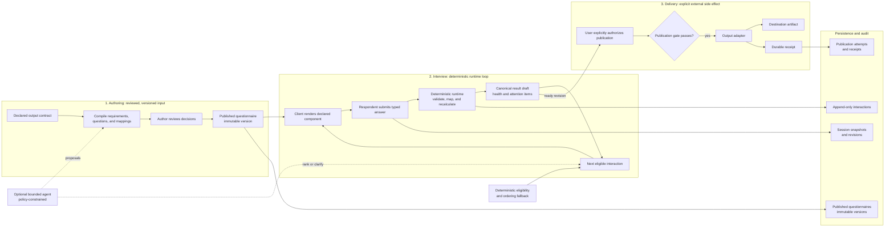

# Qava

An output-driven Q&A engine with agent-assisted questionnaire design, adaptive interviewing, automatically selected answer controls, continuous result projection, and explainable result health.

Qava has one essential loop:

```text
Ask a question
    -> capture a typed answer with the right UI
    -> apply the answer to a declared output contract
    -> evaluate the resulting draft
    -> ask the most useful next question
```

The purpose of a Qava interview is not merely to complete a questionnaire. Its purpose is to produce a specific, usable output.

That output may ultimately become:

- a JSON or NoSQL document;
- one or more relational database records;
- a CSV file;
- an Excel workbook;
- a message-bus message;
- an API request;
- or another structured artifact implemented by an output adapter.

The MVP uses a typed JSON document as the canonical result. It continuously produces a preview after every accepted answer and publishes externally only through an explicit action. Additional destinations translate the same canonical result through pluggable adapters.

---

## Product Thesis

Qava turns an output requirement into an adaptive, renderable interview.

An author supplies an output contract describing the data that must be produced. Qava helps compile that contract into a questionnaire: questions, answer types, mappings, validation, and presentation metadata. During an interview, the runtime combines deterministic contract rules with a bounded agent to decide what to ask next, when clarification is useful, and how healthy the current result is.

```text
Output contract
    -> questionnaire compiler
    -> published questionnaire
    -> adaptive Q&A session
    -> canonical result draft
    -> output adapter
    -> destination artifact
```

The engine owns the complete path from question to usable data:

1. understand what the output requires;
2. determine what information is missing;
3. present an appropriate answer-capture control;
4. capture a typed, normalized value;
5. map that value into the result;
6. evaluate result completeness and quality;
7. choose the next useful question;
8. publish through an output adapter when requested.

This is the product. Topic navigation, persistence, audit history, concurrency, and AI orchestration support this loop; they must not obscure it.

---

## Run Locally

**Prerequisites:** Python 3.12, [uv](https://docs.astral.sh/uv/), and Node.js with npm.

Install the backend and frontend dependencies from the repository root:

```powershell
uv sync --project backend
npm --prefix frontend install
```

Start the API in one terminal:

```powershell
uv run --project backend uvicorn qava.main:app --host 127.0.0.1 --port 8000
```

Start the Vue client in another:

```powershell
npm --prefix frontend run dev
```

The API is available at `http://127.0.0.1:8000`, with OpenAPI at `/openapi.json`. The client is
available at `http://127.0.0.1:5173`; open a real interview route such as
`/sessions/{sessionId}`, not the placeholder `/sessions` route.

For a guided local session, follow [the manual smoke test](docs/manual-smoke-test.md). To
republish the checked-in custom-home definition and receive a fresh session URL, run
[publish-new-questionnaire-version.ps1](docs/publish-new-questionnaire-version.ps1) after the
backend has started. Published versions and their sessions are immutable, so an existing session
does not acquire newly published definition changes.

## Validate Changes

Run focused checks while working, then choose the broader check that matches the affected surface:

```powershell
# Backend tests
uv run --project backend pytest

# Frontend type check and component tests
npm --prefix frontend run typecheck
npm --prefix frontend test -- SemanticRenderer.spec.ts

# Compile, publish, and render the checked-in definition pack in Playwright
npm --prefix frontend run test:e2e:pack
```

The definition-pack browser smoke test covers both conditional paths in the custom-home pack and
runs desktop, mobile, and reduced-motion Chromium projects. It is the quickest end-to-end guard
against a definition, compiler, or generic renderer producing an unsupported answer control.

---

## How Qava Works



  **Diagram key:** Solid arrows are required or deterministic product flow. Dashed arrows are optional, policy-constrained assistance. The MVP's canonical result is typed JSON; an output adapter translates a ready revision only after explicit authorization.

  Read the detailed model in [authoring and compilation](#1-authoring-and-compilation), the [runtime interview](#2-runtime-interview), [continuous result projection](#continuous-result-projection), [result health](#result-health), [output adapters and publication](#output-adapters-and-publication), [persistence and audit](#persistence-and-audit), and [safety and trust boundaries](#safety-and-trust-boundaries).

  Without diagram rendering:

  1. An author starts with a declared output contract. Qava compiles reviewable requirements, questions, mappings, component choices, health rules, and agent policy; the author publishes an immutable questionnaire version.
  2. A respondent starts a session against that version. The client renders the declared component, and the deterministic runtime validates each typed answer, applies declared mappings, and recalculates the draft, health, attention items, and next eligible interaction.
  3. A bounded agent may propose authoring decisions or rank and clarify within policy. Deterministic eligibility and ordering keep the interview operable when assistance is unavailable or invalid.
  4. The draft is inspectable after every accepted answer and does not write externally. Session snapshots, interaction history, and generated-interaction evidence support resume and audit.
  5. A user explicitly authorizes publication of a ready revision. The publication gate validates that revision, an adapter delivers it to a destination, and Qava records the attempt and receipt.

---

## Design Goals

### 1. Output first

The declared output contract is the source of truth. Questions exist because the output needs evidence or values.

### 2. Simple runtime model

The runtime should be understandable as:

```text
Published Questionnaire + Session Answers -> Next Question + Result Draft + Health
```

Qava is not a general workflow language, graph runtime, autonomous multi-agent platform, or form-code generator.

### 3. UI is part of the engine

Question metadata must be rich enough for the system to select an appropriate UI component and capture the correct machine value. Clients render a component specification returned by the engine; they do not contain questionnaire-specific business logic.

### 4. Agentic where judgment helps, deterministic where correctness matters

AI may propose questions, infer presentation, choose among unresolved requirements, formulate prompts, and request clarification. Schemas, identifiers, validation, mappings, accepted values, publication, and contract satisfaction remain enforceable and auditable.

### 5. Useful at every stage

Every accepted answer produces a new canonical result draft and an updated health assessment. A user or downstream system need not wait until the questionnaire is complete to inspect useful output.

### 6. Explainable health

A headline score is supported by dimensions, evidence, and attention items. The score must never be an unexplained AI opinion.

### 7. Compile flexibility into stability

AI may help design a questionnaire, but a published questionnaire is immutable and versioned. Runtime adaptation occurs inside declared bounds so sessions remain resumable, testable, and reproducible.

---

## The Two Main Phases

Qava separates questionnaire creation from questionnaire execution.

## 1. Authoring and Compilation

The primary authoring input is an output contract. For the MVP, that contract is JSON Schema plus Qava annotations where needed.

The compiler derives or proposes:

- requirements that need answers;
- question prompts;
- answer types and constraints;
- stable choice IDs and display labels;
- output mappings;
- dependencies and applicability conditions;
- UI component specifications;
- health weights and criticality;
- agent permissions and boundaries.

Some decisions are deterministic. Others may be inferred by an authoring agent. Ambiguous decisions are presented to the author for confirmation.

The authoring agent has one bounded operation. Given an output schema, field descriptions, the component catalog, and existing author decisions, it returns structured proposals for questions, answer metadata, mappings, and compatible components. Every proposal includes confidence and reasons. The compiler validates each proposal; the author accepts, changes, or rejects unresolved proposals before publication. The agent never publishes a questionnaire itself.

The compiler produces a self-contained, immutable **Published Questionnaire**. Runtime execution does not depend on repeating authoring-time inference.

```text
Draft output contract
    -> inspect fields and constraints
    -> propose requirements and questions
    -> infer UI components
    -> ask author only about ambiguity
    -> validate mappings and IDs
    -> publish immutable questionnaire version
```

The author may override prompts, grouping, ordering preferences, UI choices, weights, and agent policy without writing application code.

Authoring is a draft workflow rather than a runtime session. A draft exposes unresolved decisions, accepts author choices, reruns validation, and becomes immutable only when the author explicitly publishes it. Component confirmation is one of these draft decisions, not a user-facing interview interaction.

## 2. Runtime Interview

The runtime loads one published questionnaire version and manages a session against it.

After every accepted action it returns one complete session view containing:

- current progress;
- the current question or clarification;
- the component specification required to answer it;
- the canonical result draft;
- result health and attention items;
- publication readiness.

The runtime agent may adapt the interview within the published policy. It cannot change the output contract, invent destination fields, bypass validation, silently reinterpret stable choice IDs, or publish an artifact.

---

## Core Model

The conceptual model has six primary entities.

### Output Contract

The output contract defines the shape and rules of the desired artifact. It describes what must be produced, independently of how questions are phrased.

For the MVP it is represented by JSON Schema:

```json
{
  "$schema": "https://json-schema.org/draft/2020-12/schema",
  "type": "object",
  "required": ["customer", "favourite_colour_id"],
  "properties": {
    "customer": {
      "type": "object",
      "required": ["name"],
      "properties": {
        "name": {
          "type": "string",
          "minLength": 1
        }
      }
    },
    "favourite_colour_id": {
      "type": "string",
      "enum": ["red", "green", "blue"]
    }
  }
}
```

The contract governs result shape and validation. It does not need to contain all presentation details.

### Requirement

A requirement is an addressable unit of output need. It connects the output contract to the interview.

```json
{
  "id": "favourite-colour",
  "target": "/favourite_colour_id",
  "value_schema": {
    "type": "string",
    "enum": ["red", "green", "blue"]
  },
  "required": true,
  "criticality": "normal"
}
```

In the MVP, a requirement is satisfied by:

- one direct answer copied to its target; or
- several declared answers composed into one value.

Requirements, not question count, are the basis of completion and health.

For the MVP, think of a requirement simply as an output field that needs an answer. It is derived from an addressable output field and its schema, not a second competing schema or an independently managed business object. The explicit ID exists so questions, health evidence, and provenance can refer to an output need without depending on a fragile display name. Most readers can hold four working entities — output contract, question, session, and result. The standalone requirement concept only earns its keep when a single output need genuinely spans multiple fields.

Post-MVP, a requirement may also be satisfied by a deterministic derived value or an agent-assisted extraction that is validated before acceptance. Those modes are deferred so the core loop stays small.

### Question

A question is a request for evidence or a value needed by one or more requirements.

```json
{
  "id": "favourite-colour-question",
  "requirement_ids": ["favourite-colour"],
  "prompt": "What is your favourite colour?",
  "answer": {
    "schema": {
      "type": "string",
      "enum": ["red", "green", "blue"]
    },
    "choices": [
      { "id": "red", "label": "Red" },
      { "id": "green", "label": "Green" },
      { "id": "blue", "label": "Blue" }
    ]
  },
  "mapping": {
    "target": "/favourite_colour_id",
    "mode": "direct"
  },
  "presentation": {
    "component": "radio_group"
  }
}
```

The displayed label and stored value are intentionally different. Selecting **Green** stores the stable ID `green`, not an arbitrary display string.

Choice IDs are immutable within a published questionnaire version. A label may be corrected without changing its machine meaning during drafting; changing the meaning or identifier after publication requires a new questionnaire version.

Questions may be authored directly or generated during compilation. At runtime, an agent may formulate an allowed question or clarification, but it must bind the interaction to declared requirement IDs and an accepted answer schema.

A question may have a small applicability condition referencing accepted answer IDs. The MVP condition vocabulary is deliberately limited to `equals`, `contains`, and `exists`; nested scripts and a general expression language are out of scope. Applicability is recalculated after every accepted answer.

### Component Specification

A component specification is a domain-neutral instruction to a renderer.

```json
{
  "name": "radio_group",
  "props": {
    "choices": [
      { "value": "red", "label": "Red" },
      { "value": "green", "label": "Green" },
      { "value": "blue", "label": "Blue" }
    ]
  }
}
```

It describes presentation but does not redefine the answer contract. The answer schema remains authoritative for accepted values.

### Session

A session is the authoritative evolving state of one interview:

- questionnaire identity and version;
- latest accepted answers;
- current navigation context;
- generated runtime interactions;
- revision number;
- lifecycle status;
- publication records.

Progress, result drafts, health, applicability, and next-question candidates are derived whenever possible.

### Result Projection

The result projection is the current canonical output document built from accepted answers and mappings.

It is available at every session revision:

```json
{
  "session_id": "session-123",
  "questionnaire": {
    "id": "customer-preferences",
    "version": 1
  },
  "revision": 7,
  "status": "in_progress",
  "data": {
    "customer": {
      "name": "Ada"
    },
    "favourite_colour_id": "green"
  },
  "health": {
    "score": 82,
    "readiness": "needs_attention"
  }
}
```

The projection is not the session and is not merely a transcript. It is the typed artifact the interview currently supports.

---

## Automatic UI Component Selection

Automatic component selection is a first-class Qava capability.

The engine resolves presentation from the answer contract and question context. The result must be predictable at runtime while allowing AI assistance during questionnaire compilation.

## Resolution Strategy

Component resolution uses this precedence:

1. **Author override** — an explicit compatible component wins.
2. **Deterministic inference** — schema shape and constraints select a component when the answer is unambiguous.
3. **Agent recommendation** — semantic context resolves choices among compatible components.
4. **Author confirmation** — unresolved or low-confidence decisions are surfaced during authoring.
5. **Safe fallback** — a generic schema-compatible component is used when policy permits it.

The resolved component is stored in the published questionnaire. Runtime clients do not invoke an AI model merely to choose a control.

## Deterministic Examples

| Answer metadata | Default component | Stored value |
|---|---|---|
| `boolean` | `boolean_choice` | `true` or `false` |
| string enum, one value, 2–5 choices | `radio_group` | choice ID |
| string enum, one value, many choices | `select` or searchable `combobox` | choice ID |
| array of enum values | `checkbox_group` or multi-select | choice ID array |
| short unconstrained string | `text_input` | string |
| long or descriptive string | `textarea` | string |
| integer or number with bounds | `number_input` or slider when appropriate | number |
| currency annotation | `money_input` | amount and currency |
| date format | `date_picker` | ISO date |
| date-time format | `datetime_picker` | ISO timestamp |
| address annotation | `address_input` | structured address object |
| file/media annotation | `file_upload` | durable asset reference |
| array of objects | `repeating_group` | array of typed items |

Cardinality, option count, accessibility, device capability, and author policy refine these defaults.

For example, an enum does not always imply radio buttons. Five visible options may suit a radio group, while fifty options call for a searchable combobox. Both capture the same stable choice ID.

## Collections and Dynamic Options

Two capabilities let the same inference handle variable-length and context-dependent answers.

**Collections.** A `repeating_group` captures an array of typed items, such as a list of contacts or line items. Each item field resolves its own control through the same resolution strategy — resolution is recursive — within a bounded nesting depth. The stored value is an array of typed objects, not free text.

**Dynamic option sources.** Some choices are not fixed when a questionnaire is authored. A question may source its choices from a named system provider instead of a static enum, while still storing a stable ID. This keeps the label/value separation intact for options that are only known at runtime.

## Semantic Assistance

Schema alone may not distinguish between compatible controls. An authoring agent may use:

- the question's wording and intent;
- requirement description;
- output field semantics;
- option count and labels;
- surrounding questions;
- expected user population;
- rendering channel and accessibility constraints.

The agent returns a structured recommendation:

```json
{
  "component": "radio_group",
  "confidence": 0.94,
  "reasons": [
    "The answer is a required single choice.",
    "There are only three stable options.",
    "Displaying all options reduces interaction cost."
  ]
}
```

The compiler verifies that the component can produce values accepted by the answer schema. Agent confidence never overrides compatibility.

## Component Catalog

The component catalog defines the vocabulary supported by a renderer:

- component name and version;
- compatible answer-schema shapes;
- accepted presentation properties;
- capabilities and constraints;
- accessibility expectations;
- fallback component.

The MVP may have one built-in web catalog and renderer. The contract is intentionally pluggable so another renderer can map the same semantic component specification to native mobile, terminal, voice, or other UI controls.

A renderer may vary visual appearance, but it must preserve answer semantics.

---

## Agentic Interviewing

Qava uses a bounded agent, not an unrestricted agent.

The agent's goal is to improve the result efficiently by selecting or formulating the most useful allowed interaction.

It may:

- choose the next unresolved requirement instead of following a rigid order;
- rephrase an approved question for clarity while preserving meaning;
- ask a schema-constrained clarification;
- recognize that an earlier answer satisfies another requirement;
- propose a normalized value extracted from free text;
- identify ambiguity, contradiction, or weak evidence;
- recommend that the user review an existing answer;
- explain why a question matters to the output.

It may not:

- alter the published output contract;
- create arbitrary destination fields;
- accept a value that fails its schema;
- fabricate an answer;
- silently replace a user's accepted answer;
- mark a requirement satisfied without evidence;
- hide unresolved blocking issues;
- perform an external publication side effect;
- escape the questionnaire's declared agent policy.

## Next-Question Decision

The engine first creates a deterministic set of eligible interactions:

1. unresolved required requirements;
2. invalid or conflicting accepted answers;
3. optional requirements that improve health;
4. allowed clarifications for ambiguous evidence;
5. review interactions when a prior answer needs confirmation.

The agent may rank that bounded set using expected information gain, user context, interview coherence, and requirement criticality. If the agent is unavailable or its response is invalid, deterministic ordering provides a complete fallback.

This preserves a key property:

```text
AI improves the interview, but the interview remains operable without AI.
```

## Runtime-Generated Questions

A generated question is permitted only when it declares:

- the requirement it serves;
- the answer schema it must satisfy;
- an approved component or resolvable presentation contract;
- its reason for being asked;
- whether it is required, optional, or clarifying;
- the policy limit under which it was generated.

Generated interactions are persisted for resume, audit, and reproducibility. Their answers enter the result only through validated mappings.

The MVP should keep runtime generation conservative: choose and rephrase compiled questions, plus ask bounded clarifications. Broader question synthesis can be enabled later without changing the core contracts.

---

## Answers, Evidence, and Mapping

An accepted answer contains more than a raw value:

```json
{
  "question_id": "favourite-colour-question",
  "requirement_ids": ["favourite-colour"],
  "value": "green",
  "display_value": "Green",
  "source": "user",
  "answered_at_revision": 7
}
```

Only `value` participates in typed projection. `display_value` is convenience metadata and cannot replace the stable machine value.

Mapping modes should remain small:

- `direct` — copy the accepted value to one target;
- `compose` — combine declared answers into an object or array;

These two modes are sufficient for the MVP. Later extensions may add named deterministic transforms or agent-assisted extraction from free text. Such extraction produces only a proposal: it must pass the target schema and be confirmed when policy requires it.

All mappings target declared output locations. Mapping failures become attention items; they do not silently corrupt the result.

If an earlier answer changes, dependent mappings, applicability, health, and projections are recalculated. Historical interactions remain available for audit.

---

## Continuous Result Projection

The canonical result draft is rebuilt or incrementally updated after every accepted answer.

For each active mapping, the projector:

1. locates accepted supporting answers;
2. validates their typed values;
3. applies the declared mapping;
4. validates the affected result region;
5. records provenance from output value to supporting answer;
6. reports unresolved requirements and mapping issues.

The result has three useful statuses:

- `in_progress` — useful draft, but required requirements remain unresolved;
- `ready` — contract-valid and eligible for publication;
- `published` — a specific revision has been delivered successfully by an adapter.

`Ready` does not mean perfect. It means the configured publication gate has been satisfied.

Health has no separate lifecycle. Its `readiness` value explains the current projection status: `not_ready` maps to `in_progress`, while `ready` maps to `ready`. `needs_attention` is an advisory signal and may accompany either status depending on the publication policy. `published` is recorded only by a successful adapter receipt.

---

## Result Health

Health evaluates the fitness of the current result, not merely how many questions have been answered.

The MVP reports five dimensions:

### Completeness

How much required and weighted output information is present?

### Validity

Does the projected output satisfy its schemas and deterministic business rules? When a result targets an adapter with a validation gate, validity may include a dry run of that gate so blocking structural errors surface as attention items before publication is attempted.

### Confidence

How strong is the evidence supporting mapped values? Direct typed user selections generally have higher confidence than unconfirmed agent extraction.

### Consistency

Are related values mutually compatible, with no unresolved contradictions?

### Specificity

Are values sufficiently precise for their intended use, rather than merely present?

Each dimension is scored from 0 to 100 using published, inspectable rules. A weighted headline score summarizes the dimensions:

$$
H = \frac{\sum_{d \in D} w_d s_d}{\sum_{d \in D} w_d}
$$

where $s_d$ is a dimension score and $w_d$ is its configured weight.

The score is accompanied by a readiness state and concrete attention items:

```json
{
  "score": 82,
  "readiness": "needs_attention",
  "dimensions": {
    "completeness": 90,
    "validity": 100,
    "confidence": 75,
    "consistency": 100,
    "specificity": 60
  },
  "attention": [
    {
      "code": "ambiguous-budget",
      "severity": "warning",
      "requirement_id": "project-budget",
      "message": "The budget is present but does not say whether land is included.",
      "recommended_action": "Ask a clarification about budget scope."
    }
  ]
}
```

Numerical scores are never the sole publication criterion. Blocking schema errors and required missing values remain explicit gates. Agent-produced quality observations must cite supporting answers and may affect a dimension only according to published policy.

Health is revision-specific. The same session may have different health assessments as answers change.

---

## Output Adapters and Publication

The canonical JSON result separates interview logic from destination side effects.

An output adapter implements a small contract:

```text
validate(result, destination configuration)
preview(result)
publish(result, idempotency key)
```

Potential adapters include:

- JSON document;
- questionnaire registry (self-hosted authoring);
- MongoDB or another document store;
- relational table mapping;
- CSV;
- Excel workbook;
- Kafka, Service Bus, or another message broker;
- HTTP API request.

The MVP implements the JSON document adapter, and the questionnaire registry adapter once self-hosted authoring is enabled.

## Preview and Publish

Projection is continuous and side-effect free. Publication is explicit.

```text
Every answer -> update draft and health
Explicit publish -> validate gate -> invoke adapter -> record receipt
```

This prevents partially answered interviews from accidentally writing records or emitting messages. A later adapter policy may support continuous synchronization, but it is not the default behavior.

Publication uses the exact session revision requested. It is idempotent and produces a receipt containing adapter identity, destination, revision, timestamp, status, and external reference where available.

---

## Published Questionnaire

A published questionnaire is the immutable runtime package. It contains:

- identity and version;
- canonical output schema;
- requirements;
- questions and answer schemas;
- stable choices;
- mappings and deterministic transforms;
- applicability and validation rules;
- resolved component specifications;
- grouping and navigation metadata;
- health policy;
- agent policy;
- output adapter configuration schema.

Authoring sources may be split across readable files. Publication assembles and validates them as one document.

Publication checks include:

- unique IDs;
- valid requirement-to-output targets;
- valid question-to-requirement links;
- compatible answer schemas and UI components;
- stable and unique choice IDs;
- non-conflicting output mappings;
- valid dependency references;
- valid deterministic transforms;
- satisfiable required output fields;
- valid health weights and publication gates;
- bounded agent permissions.

Changing a published questionnaire creates a new version. Existing sessions remain attached to their original version unless an explicit migration is designed and executed.

---

## Administration: Self-Hosted Authoring

Qava administers itself. The questionnaire builder is not a separate application; it is a Qava questionnaire whose output is another questionnaire.

Because a published questionnaire is a JSON document with a schema, that schema can serve as an output contract:

```text
Meta output contract  = the published-questionnaire schema
Answers               = questionnaire-design decisions
Result projection     = a questionnaire document
Publication           = register a new published questionnaire version
```

Every engine capability is reused rather than rebuilt:

- automatic UI selection renders the builder itself — choosing a control is an enum question, and entering options is a collection question;
- the authoring agent proposes prompts, mappings, and components for the questionnaire being designed;
- health reports how complete and coherent the in-progress questionnaire is;
- the publication gate becomes the meta interview's validation, surfaced live as validity attention items;
- a registry adapter performs the explicit, gated, idempotent publication.

### Registry Adapter

The registry adapter's `validate` step is the standard questionnaire publication gate. Its `publish` step writes the canonical result into the Published Questionnaires store as a new immutable version and returns a receipt of `{ id, version }`. Republishing an edited questionnaire creates the next version, consistent with normal versioning.

### What the Meta Contract Needs

Self-hosting requires two capabilities beyond a flat questionnaire, both already defined for general use:

1. **Collections.** A questionnaire holds a variable number of questions, and each holds a variable number of choices. The `repeating_group` component captures these as arrays of typed items, resolving each item field through the same inference rules within a bounded nesting depth.
2. **Dynamic option sources.** Some choices are not fixed at authoring time — for example, "which component?" is drawn from the live component catalog. A question sources those choices from a named system provider while still storing a stable ID.

### Bootstrap

The first meta-questionnaire is authored once by hand, or directly by the authoring agent, and published. After that, any questionnaire — including the meta-questionnaire itself — can be edited through Qava. This is a standard compiler bootstrap and terminates cleanly: editing the meta-questionnaire simply produces its next version.

### Escape Hatch

Guided Q&A is the default authoring experience, ideal for first-time and structured authoring. For bulk edits, authors may submit or edit the raw questionnaire JSON directly. The raw path passes the same publication gate, so both routes converge on identical validation.

Cross-document references, such as a condition naming another question, are validated at the publication gate rather than per keystroke, and appear as health attention items during authoring.

---

## Session View and Client Contract

The backend returns one renderable view after reads and mutations:

```json
{
  "session": {
    "id": "session-123",
    "revision": 7,
    "status": "active",
    "questionnaire_id": "customer-preferences",
    "questionnaire_version": 1
  },
  "progress": {
    "satisfied_required": 8,
    "total_required": 10
  },
  "current_interaction": {
    "id": "favourite-colour-question",
    "kind": "question",
    "prompt": "What is your favourite colour?",
    "required": true,
    "answer_schema": {
      "type": "string",
      "enum": ["red", "green", "blue"]
    },
    "component": {
      "name": "radio_group",
      "props": {
        "choices": [
          { "value": "red", "label": "Red" },
          { "value": "green", "label": "Green" },
          { "value": "blue", "label": "Blue" }
        ]
      }
    }
  },
  "result": {
    "status": "in_progress",
    "data": {},
    "health": {
      "score": 74,
      "readiness": "not_ready"
    }
  },
  "actions": ["answer", "skip", "save_and_exit"]
}
```

The client is responsible for:

- rendering the returned semantic component;
- collecting a value;
- submitting user actions;
- displaying progress, result preview, health, and errors;
- applying its own visual design system.

The client is not responsible for:

- choosing questionnaire-specific controls;
- deciding answer types;
- mapping values into outputs;
- choosing the next question;
- determining requirement satisfaction;
- calculating health;
- deciding publication readiness.

Unsupported components must fail explicitly or use a declared compatible fallback. They must not degrade typed values into arbitrary strings.

## Definition-Pack Browser Smoke Test

Run the following from `frontend/` to compile the checked-in custom-home definition pack with the production compiler, publish it through the normal API, and render every interaction in two conditional scenarios:

```powershell
npm run test:e2e:pack
```

The test runs against desktop, mobile, and reduced-motion Chromium projects. It supplies schema-valid sample answers through the session API so it can cover the full generated interview quickly, while failing on browser errors or an unsupported answer component. Use it after changing definition files, the pack compiler, or a renderer instead of manually republishing and stepping through the entire questionnaire.

---

## Runtime Operations

The conceptual MVP API needs six operations.

### Create a Session

```http
POST /sessions
```

Creates a session against an exact published questionnaire version and returns its initial view.

### Read or Resume a Session

```http
GET /sessions/{session_id}
```

Returns the latest complete view, including current draft and health.

### Submit an Answer

```http
POST /sessions/{session_id}/answers
```

```json
{
  "interaction_id": "favourite-colour-question",
  "expected_revision": 7,
  "value": "green"
}
```

The server validates the value, stores the accepted answer, recalculates the result and health, selects the next interaction, increments the revision, and returns the complete updated view.

Skipping is allowed only when the published question policy permits it. A skip records that the user declined or could not answer; it does not satisfy a required requirement, normally lowers completeness, and remains revisitable. Required unanswered data may therefore prevent readiness even when its question was skipped.

### Navigate

```http
POST /sessions/{session_id}/navigation
```

Allows the user to visit a declared section or unresolved requirement without embedding routing logic in the client.

### Request Result

```http
GET /sessions/{session_id}/result
```

Returns the canonical projection, health, attention items, and provenance for the current or requested revision.

### Publish Result

```http
POST /sessions/{session_id}/publications
```

```json
{
  "expected_revision": 12,
  "adapter": "json-document"
}
```

Publication succeeds only if the configured gate passes. It returns a durable publication receipt.

Optimistic concurrency prevents a stale client from overwriting a newer session revision.

---

## Persistence and Audit

A practical implementation uses four logical stores:

### Published Questionnaires

Immutable compiled documents keyed by ID and version.

### Sessions

Current authoritative state with latest answers, generated interactions, revision, lifecycle status, and navigation context.

### Interactions

Append-only records of questions shown, answers submitted, clarifications, reviews, skips, and navigation actions.

### Publications

Immutable attempts and receipts for external side effects.

This is not full event sourcing. The session snapshot is authoritative for current state; interactions explain how it was reached.

Health is normally derived from the questionnaire and current session revision rather than stored separately. Generated prompts, agent recommendations, extraction proposals, model identity, policy version, and supporting evidence are retained when needed for audit. Private reasoning is not required or stored.

---

## Safety and Trust Boundaries

AI output is always treated as untrusted structured input.

The server must:

- validate agent responses against schemas;
- enforce requirement and mapping IDs itself;
- enforce component compatibility itself;
- validate every accepted answer;
- enforce generation and clarification limits;
- distinguish user answers from inferred values;
- require confirmation for agent extraction when policy demands it;
- continue deterministically when AI fails;
- prevent agent access to undeclared tools and destinations;
- prevent publication without an explicit authorized action.

Agent failures should reduce adaptability, not corrupt output or halt an otherwise answerable questionnaire.

---

## MVP Scope

The MVP should prove the complete product loop with the smallest coherent implementation.

### Included

- JSON Schema as the output contract;
- output-contract-first questionnaire authoring;
- deterministic authoring scaffolding plus bounded agent proposals for questions and presentation metadata;
- author confirmation for ambiguous UI choices;
- immutable published questionnaire versions;
- typed questions and stable answer values;
- one built-in web component catalog and generic renderer;
- a collection (`repeating_group`) component and dynamic option sources;
- deterministic component inference with optional agent recommendation;
- bounded runtime question selection and clarification;
- self-hosted authoring: a meta-questionnaire plus a questionnaire registry adapter;
- deterministic fallback ordering;
- session persistence, resume, and answer editing;
- continuous canonical JSON result projection;
- explainable health dimensions and a headline score;
- optimistic concurrency;
- interaction and publication audit records;
- explicit publication through a JSON document adapter.

### Excluded

- general workflow or graph execution;
- unrestricted autonomous agents;
- arbitrary code generation or execution;
- runtime mutation of published contracts;
- a drag-and-drop form designer;
- collaborative multi-user editing;
- automatic migration between questionnaire versions;
- continuous database writes or message publication after every answer;
- many destination adapters before the JSON path is proven;
- UI components unconstrained by typed answer contracts.

---

## Delivery Plan

The first three phases together form the complete MVP. They are implementation slices, not separate product editions; each keeps the question-to-answer-to-output loop working end to end.

### Phase 1: Contract to Working Questionnaire

Implement:

- JSON output contracts;
- requirements, questions, and direct mappings;
- deterministic UI inference;
- collection component and dynamic option sources;
- draft authoring decisions, confirmation, and override;
- questionnaire publication;
- generic component rendering;
- sessions and typed answers;
- continuous JSON projection.

Success means an author can provide a contract, publish a questionnaire, answer it through generated UI, and see the JSON result update after every answer.

### Phase 2: Bounded Agent

Add:

- authoring-agent proposals;
- adaptive next-question ranking;
- bounded clarifications;
- structured extraction proposals;
- deterministic fallback and agent audit metadata.

Success means AI improves authoring and interview quality without controlling schemas, accepted values, or publication.

### Phase 3: Health and Publication

Add:

- completeness, validity, confidence, consistency, and specificity;
- explainable attention items;
- configurable readiness gates;
- explicit JSON publication and receipts;
- the questionnaire registry adapter and a bootstrapped meta-questionnaire, so Qava authors Qava.

Success means every revision has an understandable fitness assessment, a ready revision can be published safely, and the builder itself runs on the engine.

### Phase 4: Adapter and Renderer Ecosystem

Add adapters and renderers only after the core loop is proven:

- document databases;
- relational mappings;
- CSV and Excel;
- message buses;
- HTTP destinations;
- alternate UI platforms.

---

## MVP Acceptance Criteria

The MVP is successful when:

- an author can supply a JSON output contract;
- the system can propose the questions needed to satisfy it;
- every question has a typed answer schema and valid output mapping;
- the system can infer a compatible UI component from metadata;
- ambiguous component choices can be confirmed or overridden during authoring;
- a published questionnaire is immutable and versioned;
- a generic client can render the questionnaire without domain-specific UI code;
- enum labels are displayed while stable enum IDs are stored;
- the runtime can select the next useful eligible question;
- AI failure falls back to deterministic execution;
- every accepted answer updates a canonical JSON result;
- a partial result is available at any session revision;
- result health includes dimensions, a headline score, and explainable attention items;
- users can edit answers and see dependent result and health changes;
- stale writes are rejected;
- external publication occurs only through an explicit action;
- publication validates the exact revision and returns a receipt;
- interactions and result provenance explain how output values were produced.

---

## Architectural Summary

```text
AUTHORING

Output contract
    -> requirement discovery
    -> question and mapping proposal
    -> automatic UI component resolution
    -> author confirmation where ambiguous
    -> immutable published questionnaire


RUNTIME

Published questionnaire
+ session answers
    -> deterministic eligibility and validation
    -> bounded agent ranking and clarification
    -> next renderable question
    -> typed answer
    -> canonical result projection
    -> explainable health


DELIVERY

Canonical result at a selected revision
    -> explicit publication gate
    -> output adapter
    -> JSON / database / CSV / Excel / message / API
```

Qava is an output-driven Q&A system.

It asks for the information a declared output needs, presents the right UI to capture each answer, continuously builds and evaluates the result, and publishes that result through a destination adapter when explicitly requested.

Simply put:

```text
A question goes out.
An answer comes in.
A specific output is produced.
```
