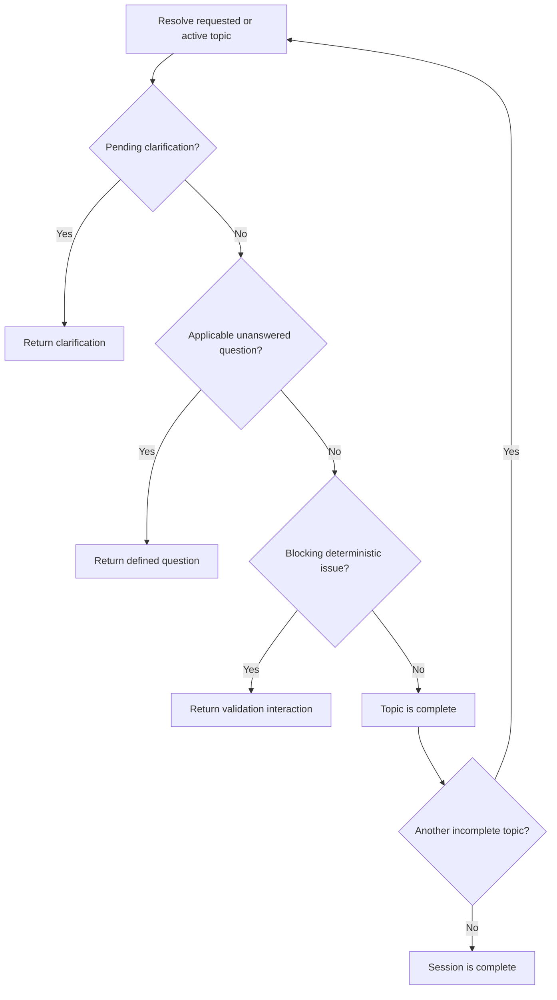

# Qava

Topic-driven adaptive interviews with deterministic progress and optional, bounded AI clarification.

Qava is an interview engine for structured consultations that need to feel flexible without becoming unpredictable. A user can see the available topics, resume later, or jump directly to a topic. New sessions start at the first incomplete topic by definition order, and the user may immediately choose a different topic. The engine follows a published question definition, may ask one optional clarification when allowed, and then returns to the defined path.

The core model is intentionally small:

```text
Published Definition
+ Session State
+ User Action
  ->
Deterministic Evaluation
  ->
Updated Session State
+ Renderable Session View
```

A custom-home intake is included as sample data. It demonstrates the engine, but it does not define the engine. The same runtime should support onboarding, assessments, inspections, applications, discovery interviews, and other structured conversations by loading a different definition.

The most important boundary is what is persisted, what is derived, and what is generated at runtime.

| Kind | Examples | Rule |
|---|---|---|
| Persisted | Published definitions, latest answers by question ID, active topic, clarification state, session revision, lifecycle status, interaction history | Store the durable facts needed to resume, audit, and continue. |
| Derived | Question applicability, topic progress, topic completion, session completion, current defined question, deterministic validation issues, result projection | Recalculate from the definition and session state. |
| Generated and persisted | AI clarification prompt, clarification answered/skipped state, AI metadata needed for audit | Persist because it did not exist in the published definition. |

---

## Product Thesis

Qava sits between a traditional form and an unrestricted AI interview.

Traditional forms are predictable but rigid. AI interviews are flexible but hard to validate, resume, audit, and complete consistently. Qava keeps the interview plan deterministic while allowing small moments of clarification where they are useful.

The deterministic layer owns:

- topics;
- question order;
- question applicability;
- required answers;
- progress;
- validation;
- topic completion;
- session completion;
- result projection.

AI is optional. It may ask one useful follow-up when a definition permits it, but it cannot change the interview plan, write answers directly, or decide whether the interview is complete.

---

## MVP Scope

The MVP proves one loop:

```text
Show topics
    ->
Create, resume, or select topic
    ->
Ask next applicable defined question
    ->
Store answer
    ->
Optionally ask one clarification
    ->
Return to the defined question path
    ->
Complete through deterministic rules
```

The MVP includes:

- immutable, versioned definitions;
- topic navigation;
- deterministic and conditional questions;
- answers stored by question ID;
- derived progress and completion;
- optimistic concurrency using a session revision;
- interaction history;
- one optional clarification for eligible questions;
- a structured result projected from the definition and answers.

The MVP does not include:

- workflow or graph runtimes;
- unrestricted AI agents;
- domain-specific engine classes;
- generated application code;
- arbitrary generated UI components;
- multi-step AI conversations;
- health scoring;
- topic summaries;
- cross-topic insights;
- full event sourcing.

Those capabilities may be added later without changing the core runtime model.

---

## Design Principles

1. **Definitions are immutable after publication.** A session references one exact definition version for its lifetime.
2. **Answers are stored by question ID.** The evolving session is not the final domain document.
3. **Results are projections.** The final output is produced by applying applicable answers to the output paths declared by their questions.
4. **Topics are first-class navigation units.** They organize questions and provide stable progress and completion boundaries.
5. **Completion is deterministic.** Required applicable questions and deterministic validation rules decide completion.
6. **AI clarification is optional and bounded.** It may improve an answer, but it cannot block completion.
7. **The backend owns interview logic.** The client renders the current session view and submits user actions.
8. **Derived state stays derived.** Topic progress, applicability, current question, and completion are calculated from the definition and answers.
9. **Generated state is explicit.** Clarification prompts and clarification answered/skipped state are persisted because they do not exist in the published definition.
10. **The engine remains domain-neutral.** It understands topics, questions, conditions, components, answers, interactions, and paths.

---

## Repository Shape

```text
data/
├── components/
│   └── catalog.v1.json
├── contracts/
│   └── v1/
│       ├── definition.schema.json
│       ├── interaction.schema.json
│       ├── question.schema.json
│       └── session.schema.json
├── definitions/
│   └── custom-home-intake/
│       └── v1/
│           ├── definition.json
│           ├── topics.json
│           └── questions/
└── examples/
    └── custom-home-intake/
        ├── clarification-request.json
        ├── clarification-response.json
        ├── result.json
        └── session.snapshot.json
```

### Components

`data/components` contains the declarative component vocabulary supported by clients. For the MVP, this is a fixed catalog rather than a plugin system.

Initial components may include:

- `short_text`
- `long_text`
- `number`
- `single_select`
- `multi_select`
- `boolean`
- `money`
- `money_range`
- `date`
- `date_range`
- `confirmation`

AI-generated clarifications should initially be limited to `short_text`.

### Contracts

`data/contracts/v1` contains stable, domain-neutral JSON Schemas for published definitions and runtime records. These schemas define contracts, not orchestration logic.

Some schemas may describe future capabilities. Their presence in the repository does not make those capabilities part of the MVP runtime.

### Definitions

`data/definitions/custom-home-intake/v1` contains the authoring source for one immutable sample definition version.

- `definition.json` is the bundle manifest and version identity.
- `topics.json` defines topic metadata and order.
- `questions/` contains the questions for each topic.

Before runtime use, authoring files are assembled, validated, and published as one immutable definition document.

### Examples

`data/examples/custom-home-intake` contains non-authoritative examples of runtime requests and records. Examples are useful for development, tests, and documentation, but they are not definition source data and must never be written back into a published definition.

---

## Definition Lifecycle

Definitions are authored as readable files and loaded at runtime as one immutable document.

```text
Authoring files
    -> assemble
    -> validate JSON Schemas
    -> validate component names
    -> validate unique question IDs
    -> validate output path collisions
Published definition document
    ->
Runtime sessions
```

A published definition is identified by `id` and `version`:

```json
{
  "id": "custom-home-intake",
  "version": 1
}
```

Changing a published definition creates a new version. Existing sessions continue to reference the version against which they were started.

---

## Core Entities

### Definition

A definition describes the expected interview structure. It owns topic metadata, question order, prompts, components, answer constraints, conditions, output paths, required status, and clarification eligibility.

It does not own session answers, active navigation, generated clarifications, progress snapshots, interaction history, or analysis results.

```json
{
  "id": "custom-home-intake",
  "version": 1,
  "title": "Custom Home Planning",
  "topics": [
    {
      "id": "budget",
      "title": "Budget",
      "description": "Investment, financing, priorities, and contingency",
      "questions": [
        {
          "id": "budget-target-range",
          "path": "budget.target_range",
          "prompt": "What total project budget are you considering?",
          "component": "money_range",
          "required": true,
          "props": {
            "currencies": ["CAD", "USD"],
            "allow_unknown": true
          }
        }
      ]
    }
  ]
}
```

Array order is canonical unless an authoring requirement proves that explicit numeric ordering is needed.

### Topic

A topic is both a navigation unit and a deterministic collection goal. Each defined question belongs to exactly one primary topic.

Example custom-home topics:

```text
Custom Home Planning
├── Project
├── Land & Site
├── Household & Lifestyle
├── Home Structure
├── Rooms & Spaces
├── Style & Character
├── Exterior & Outdoor Living
└── Budget & Delivery
```

A topic does not need persisted progress state. Its status can be derived from applicable questions, required questions, recorded answers, and deterministic validation issues.

### Question

A defined question has a stable identity and one declared output path.

```json
{
  "id": "bedroom-count",
  "path": "rooms.bedrooms.count",
  "prompt": "How many bedrooms should the home have?",
  "component": "number",
  "required": true,
  "props": {
    "minimum": 1,
    "maximum": 12
  }
}
```

A conditional question is still a defined question. It includes a small, declarative condition.

```json
{
  "id": "home-office-details",
  "path": "rooms.home_office",
  "prompt": "What should the home office support?",
  "component": "multi_select",
  "required": true,
  "when": {
    "question_id": "special-spaces",
    "operator": "contains",
    "value": "home_office"
  },
  "props": {
    "options": [
      "Video calls",
      "Two workstations",
      "Client meetings",
      "Built-in storage"
    ]
  }
}
```

Conditions should reference stable question IDs, not output paths. The initial condition vocabulary should remain small: `equals`, `contains`, and `exists`.

Nested expressions, scripts, variables, and a general workflow language are out of scope for the MVP.

For the MVP, every displayed defined question should be required. Optionality should be expressed through applicability rules. AI clarifications are the only optional interactions.

### Session

A session stores the authoritative, evolving interview state.

```json
{
  "id": "session-123",
  "definition_id": "custom-home-intake",
  "definition_version": 1,
  "revision": 18,
  "lifecycle_status": "active",
  "active_topic_id": "budget",
  "answers": {
    "budget-target-range": {
      "value": {
        "minimum": 700000,
        "maximum": 900000,
        "currency": "CAD"
      },
      "answered_at_revision": 17
    }
  },
  "clarifications": {
    "design-priorities": {
      "status": "skipped",
      "clarification_id": "clarification-456"
    }
  }
}
```

The session answer map contains the latest accepted value for each question. Editing an answer overwrites that latest value and appends a new interaction record.

The session lifecycle status is not the same as deterministic completion. For the MVP, lifecycle status should be `active`, `submitted`, or `archived`. Completion is derived from the definition and current answers. A session may be submitted only after deterministic completion has been reached.

The session should not persist topic progress, topic completion, current defined question, applicability results, validation issues, health scores, or the projected final document. Those values can be derived from the definition and current answers.

### Interaction

An interaction is an append-only record of what was shown and what the user submitted. It supports audit, debugging, replay, analytics, clarification tracing, and result explanation.

```json
{
  "id": "interaction-456",
  "session_id": "session-123",
  "session_revision": 18,
  "kind": "defined_question",
  "action": "answer_updated",
  "topic_id": "budget",
  "question_id": "budget-target-range",
  "question": {
    "prompt": "What total project budget are you considering?",
    "component": "money_range"
  },
  "answer": {
    "minimum": 700000,
    "maximum": 900000,
    "currency": "CAD"
  }
}
```

Current state remains fast to read while interactions retain history without introducing full event sourcing.

Every accepted user action appends an interaction record. Useful action names include `answer_created`, `answer_updated`, `clarification_answered`, `clarification_skipped`, and `navigation_changed`.

---

## Runtime Flow

For the active topic, the engine calculates the next interaction in this order:

1. Return a persisted pending clarification, if one exists for the topic.
2. Find the first applicable unanswered defined question.
3. If none exists, evaluate deterministic validation rules.
4. If no blocking issue exists, derive the topic as complete in the returned view.
5. Continue to another incomplete topic or derive the session as complete.

Defined questions are derived from the published definition and current answers. AI clarifications are generated and persisted. Deterministic validation issues are derived from explicit validation rules.



The normal experience remains predictable:

```text
Defined Q1
Defined Q2
Optional clarification
Defined Q3
Defined Q4
Topic complete
```

---

## Applicability and Answer Retention

Applicability is recalculated after every accepted answer.

If an earlier answer changes and a question becomes inapplicable:

- its answer remains in the session answer map;
- it is ignored for progress, completion, and result projection;
- its previous interactions remain available for audit.

This avoids destructive deletion and allows the answer to become active again if conditions later change. Only currently applicable answers are projected into the result.

---

## Completion

A topic is complete when all applicable required defined questions are answered and all blocking deterministic validation issues are resolved.

A session is complete when every topic containing applicable required questions is complete.

The MVP should not include optional topics. Optionality should be handled through conditional or non-applicable questions.

AI-generated clarification does not block completion.

```text
Deterministic rules decide completion.
AI may improve understanding.
```

---

## Bounded AI Clarification

AI is optional intelligence around the deterministic interview. It is not the interview itself.

For an eligible answer, AI may assess whether one additional piece of context would be useful and return one schema-constrained clarification.

MVP limits:

- only questions explicitly marked as clarification-eligible are assessed;
- no more than one clarification is created per defined question;
- the clarification is optional and skippable;
- the clarification uses `short_text` only;
- the server assigns its identity, parent question, and topic;
- the model cannot create a result path;
- the model cannot write session answers directly;
- the model cannot modify the definition;
- the model cannot mark a topic or session complete;
- invalid output, timeout, or model failure continues to the next defined question.

Clarification state is stored by parent question so the engine can enforce the one-clarification rule even after a clarification is answered, skipped, or fails.

```json
{
  "clarifications": {
    "design-priorities": {
      "status": "skipped",
      "clarification_id": "clarification-456"
    }
  }
}
```

Initial statuses should remain small: `pending`, `answered`, `skipped`, `not_needed`, and `failed`.

Clarification policy on a defined question:

```json
{
  "id": "design-priorities",
  "path": "vision.priorities",
  "prompt": "What matters most in the design of your home?",
  "component": "long_text",
  "required": true,
  "clarification": {
    "enabled": true,
    "goal": "Identify the user's highest priority or an important trade-off"
  }
}
```

Model response contract:

```json
{
  "needs_clarification": true,
  "reason": "The answer describes several priorities without identifying which should be protected first.",
  "prompt": "If a trade-off becomes necessary, which priority should be protected first?"
}
```

Stored runtime interaction:

```json
{
  "id": "clarification-456",
  "kind": "clarification",
  "topic_id": "vision",
  "parent_question_id": "design-priorities",
  "prompt": "If a trade-off becomes necessary, which priority should be protected first?",
  "component": "short_text",
  "required": false
}
```

The clarification answer is attached to the parent answer context and is not assigned an arbitrary domain output path.

---

## Deterministic Validation

Blocking follow-ups must come from explicit rules, not AI judgment.

Examples:

- a minimum value exceeds a maximum value;
- an end date occurs before a start date;
- an answer contradicts another declared answer;
- a required structured field is missing.

Validation interactions may block completion because the trigger and resolution are deterministic.

For the MVP, validation issues should be derived each time from validation rules instead of persisted as pending generated interactions. If a validation is shown or resolved, that user-facing event can still be recorded in the interaction history.

```json
{
  "kind": "validation",
  "topic_id": "budget",
  "question_id": "budget-target-range",
  "message": "The minimum budget cannot exceed the maximum budget.",
  "component": "money_range"
}
```

---

## Session View

The backend returns one renderable session view after every read or mutation.

```json
{
  "session": {
    "id": "session-123",
    "revision": 19,
    "lifecycle_status": "active",
    "completion_status": "in_progress",
    "active_topic_id": "budget"
  },
  "topics": [
    {
      "id": "budget",
      "title": "Budget & Delivery",
      "status": "in_progress",
      "answered_required": 3,
      "applicable_required": 6
    },
    {
      "id": "rooms",
      "title": "Rooms & Spaces",
      "status": "complete",
      "answered_required": 7,
      "applicable_required": 7
    }
  ],
  "current_interaction": {
    "id": "budget-contingency",
    "kind": "defined_question",
    "topic_id": "budget",
    "prompt": "How much contingency are you planning?",
    "component": "money",
    "required": true,
    "props": {}
  }
}
```

The client should not need separate progress and next-question endpoints after every answer.

---

## Runtime API

The MVP client requires four operations.

### Start a Session

```http
POST /sessions
```

```json
{
  "definition_id": "custom-home-intake",
  "definition_version": 1
}
```

Returns a complete session view containing the topic menu and initial interaction.

Creating a session selects the first incomplete topic by definition order. The user may immediately select a different topic.

### Read or Resume a Session

```http
GET /sessions/{session_id}
```

Returns the latest session view. Resume is derived from the stored active topic, current answers, and clarification state.

### Select a Topic

```http
POST /sessions/{session_id}/navigation
```

```json
{
  "expected_revision": 18,
  "topic_id": "rooms"
}
```

The backend selects the actual next interaction in that topic.

### Submit an Answer or Clarification

```http
POST /sessions/{session_id}/answers
```

```json
{
  "interaction_id": "budget-target-range",
  "expected_revision": 18,
  "value": {
    "minimum": 700000,
    "maximum": 900000,
    "currency": "CAD"
  }
}
```

A successful mutation returns the complete updated session view. A stale `expected_revision` returns a conflict instead of overwriting newer state.

A clarification may be skipped explicitly:

```json
{
  "interaction_id": "clarification-456",
  "expected_revision": 19,
  "action": "skip"
}
```

---

## Revision and Concurrency

The session revision protects against stale clients, multiple browser tabs, and overlapping requests.

The revision increments on every accepted authoritative session mutation, including:

- answering a defined question;
- answering or skipping a clarification;
- resolving deterministic validation;
- changing the active topic;
- submitting or archiving a session, if supported.

A revision mismatch should return `409 Conflict` with the current revision and session view.

For the MVP, `active_topic_id` is shared authoritative session state, so navigation increments the revision. This assumes one active user experience per session. A later collaborative version could move topic selection into client-local state.

---

## Persistence Model

A practical first implementation needs three logical stores. The exact database schema can emerge during implementation.

### Definitions

Immutable published definition documents keyed by `id` and `version`.

### Sessions

Current authoritative session snapshots containing:

- definition identity;
- latest answers by question ID;
- active topic;
- clarification state;
- revision;
- lifecycle status.

### Interactions

Append-only records of accepted user actions and generated prompts, including displayed questions, answer changes, clarification answers, clarification skips, navigation changes, validation displays, and validation resolutions.

This is intentionally not full event sourcing. `sessions` stores the current authoritative snapshot. `interactions` stores the audit and explanation trail. Progress, completion, validation issues, and result projections are calculated from the session and published definition.

---

## Result Projection

The result is not the session record and is not merely a transcript. It is generated from the published definition version, applicable session answers, and selected clarification context.

A result projection may be generated at any revision. Its status reflects whether deterministic completion has been reached. `final` refers to the projection at a complete or submitted state, not to a separate storage mechanism.

For each applicable answered question:

1. locate the answer by question ID;
2. read the question's declared output path;
3. validate the value against the question contract;
4. write the value into the projected result;
5. ignore stored answers for currently inapplicable questions.

```json
{
  "session_id": "session-123",
  "definition": {
    "id": "custom-home-intake",
    "version": 1
  },
  "revision": 42,
  "status": "complete",
  "data": {
    "budget": {
      "target_range": {
        "minimum": 700000,
        "maximum": 900000,
        "currency": "CAD"
      }
    }
  },
  "clarifications": {
    "design-priorities": [
      {
        "prompt": "If a trade-off becomes necessary, which priority should be protected first?",
        "answer": "Natural light, even if some rooms become smaller."
      }
    ]
  },
  "interaction_summary": {
    "defined_answers": 47,
    "clarifications_answered": 4,
    "clarifications_skipped": 2
  }
}
```

Output path uniqueness should be validated when a definition is published, not discovered during result generation.

---

## Client Contract

The client renders a session view. It does not contain interview business logic.

```ts
interface SessionView {
  session: {
    id: string
    revision: number
    lifecycleStatus: "active" | "submitted" | "archived"
    completionStatus: "in_progress" | "complete"
    activeTopicId?: string
  }
  topics: TopicView[]
  currentInteraction?: InteractionView
}

interface TopicView {
  id: string
  title: string
  description?: string
  status: "not_started" | "in_progress" | "complete"
  answeredRequired: number
  applicableRequired: number
}

interface InteractionView {
  id: string
  kind: "defined_question" | "clarification" | "validation"
  topicId: string
  prompt: string
  helpText?: string
  component: QuestionComponentName
  required: boolean
  value?: unknown
  props?: Record<string, unknown>
}

interface InteractionSubmission {
  interactionId: string
  expectedRevision: number
  value?: unknown
  action?: "skip"
}
```

The client may render topics, render the declared component, collect a value, submit answers or navigation actions, and display progress and conflict messages returned by the backend.

The client may not determine question applicability, question order, topic completion, session completion, clarification eligibility, or output projection.

The component catalog is the source of component contracts: supported component names, accepted props, and answer shape. The question schema should define the generic question structure. The publisher performs cross-document validation so component constraints are not maintained in two places.

---

## Sample Domain: Custom Home Intake

The sample definition should be meaningful but bounded.

| Topic | Representative information |
|---|---|
| Project | Build type, current stage, intended use, delivery approach |
| Land & Site | Ownership, location, constraints, search priorities |
| Household & Lifestyle | Occupants, accessibility, routines, entertaining |
| Home Structure | Home type, target area, storeys, basement, circulation |
| Rooms & Spaces | Programme, room counts, priorities, special requirements |
| Style & Character | Architectural direction, materials, atmosphere, inspiration |
| Exterior & Outdoor Living | Garage, landscaping, entertaining, seasonality |
| Budget & Delivery | Budget range, scope, contingency, schedule, trade-offs |

A suitable first definition is approximately:

- 8 topics;
- 40 to 55 defined questions;
- 5 to 8 questions per topic;
- no more than one clarification per eligible question;
- approximately 10 core UI components.

Nothing in the runtime should be named `BudgetQuestion`, `GarageQuestion`, or `ArchitecturalStyleQuestion`. To the engine, these are only definitions, topics, questions, conditions, components, answers, interactions, and paths.

---

## Future Analysis Capabilities

Analysis is intentionally outside the MVP runtime. When introduced, analyses should be stored separately from the authoritative session snapshot and tied to a specific session revision.

An analysis record should include:

- session ID;
- session revision;
- analysis type;
- result payload;
- creation timestamp.

Potential future capabilities include:

- deterministic answer-quality warnings;
- topic summaries;
- contradiction detection;
- trade-off identification;
- cross-topic insights;
- evidence-backed analysis;
- confidence metadata.

These should not affect deterministic interview completion. Avoid numerical health scores until real usage demonstrates that the scoring model is useful and explainable. Prefer explicit attention signals first.

---

## Delivery Plan

### Phase 1: Deterministic Interview

Build definition assembly, validation, topic navigation, conditional questions, session answers, progress calculation, deterministic completion, interaction history, optimistic concurrency, result projection, and a generic component renderer.

Success: a user can complete the custom-home interview without AI.

### Phase 1.5: Bounded Clarification

Add clarification eligibility, one structured AI assessment, one optional `short_text` follow-up, skip support, strict timeout and schema validation, and fail-open continuation to the deterministic queue.

Success: one vague, high-value answer can produce one useful clarification without changing completion behavior.

### Phase 2: Deterministic Quality Signals

Add explicit warnings and validations based on rules.

Success: the UI can identify concrete issues without pretending that answer quality is precisely measurable.

### Phase 3: Analysis

Add topic and cross-topic analysis tied to a session revision and grounded in interaction evidence.

Success: downstream users receive explainable observations without altering the authoritative interview state.

---

## MVP Acceptance Criteria

The MVP is complete when a user can:

- start a session against an immutable published definition version;
- see all available topics before answering;
- create a session, resume it, or choose a topic;
- answer deterministic and conditional questions;
- cause conditional questions to become applicable or inapplicable;
- move between topics without losing answers;
- see deterministic topic progress;
- receive no more than one optional clarification on an eligible answer;
- answer or skip the clarification;
- return automatically to the predefined path;
- complete a topic only through deterministic rules;
- derive session completion only when all applicable required questions are answered and blocking validation issues are resolved;
- retrieve a structured result projected from applicable answers;
- receive a conflict instead of overwriting a newer session revision;
- inspect the interaction history used to produce the result.

The product thesis is proven when this works without introducing a workflow language, graph runtime, unrestricted AI agent, fact service, domain-specific engine classes, or AI-controlled completion.

---

## Architectural Summary

```text
Definition source files
        -> compile and validate
Immutable published definition
        ->
Session state
  - Latest answers by question ID
  - Active topic
  - Clarification state
  - Revision
  - Lifecycle status
        ->
Deterministic interview engine
        ->
Session view
  - Topic menu
  - Progress
  - Current interaction
  - Derived completion state

Optional AI clarifier
  - One skippable follow-up attached to a parent question
  - Answered/skipped state remembered by parent question

Result projector
  - Applicable answers written to declared output paths
  - Available at any session revision
```

Qava is a deterministic interview engine with an optional clarification step. That is the product to prove first.
