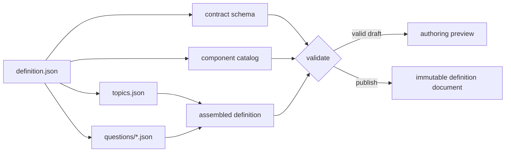
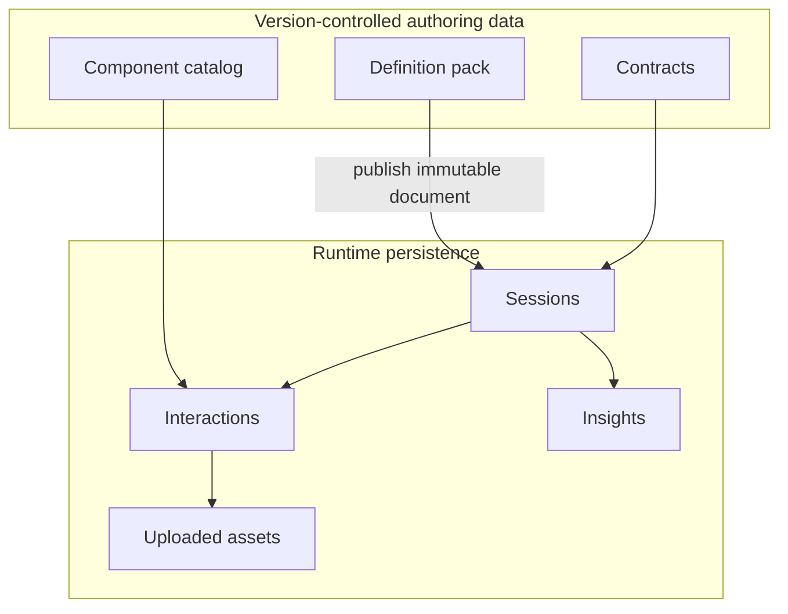

# Data Layout and Authoring Model

This document turns the product proposal into a file structure that can lead an implementation without coupling the engine to the custom-home example.

## Recommended tree

```text
data/
├── contracts/
│   └── v1/
│       ├── definition.schema.json
│       ├── question.schema.json
│       ├── session.schema.json
│       ├── interaction.schema.json
│       └── insight.schema.json
├── components/
│   └── catalog.v1.json
├── definitions/
│   └── custom-home-intake/
│       └── v1/
│           ├── definition.json
│           ├── topics.json
│           └── questions/
│               ├── project.json
│               ├── site.json
│               ├── household.json
│               ├── structure.json
│               ├── rooms.json
│               ├── style.json
│               ├── outdoors.json
│               └── budget.json
└── examples/
    └── custom-home-intake/
        ├── clarification-request.json
        ├── clarification-response.json
        ├── generated-tradeoff.json
        ├── session.snapshot.json
        ├── insight.json
        └── result.json
```

## Why these boundaries

### `contracts/` is engine-owned

Contracts define the vocabulary the runtime understands: definition manifests, questions, conditions, sessions, interactions, health, and insights. They are versioned independently from any domain pack. A contract version changes only when engine-facing structure or semantics change.

There must be no `garage`, `budget`, `bedroom`, or architectural-style knowledge in this directory.

### `components/` is a shared capability catalog

The catalog is the handshake between definition authors, server validation, AI output validation, and client renderers. It declares names and answer shapes, not Vue components or domain concepts. A server can reject an unknown component before a question reaches a client. AI-generated questions are restricted to entries with `ai_allowed: true`.

### `definitions/` is authoring source

Each definition ID has immutable numeric version directories. The manifest is intentionally small and references its topic and question files. Splitting questions by topic:

- makes deterministic ordering easy to review;
- reduces merge conflicts among definition authors;
- permits topic-level linting and ownership;
- prevents a 40–55-question pack from becoming an unreadable document;
- keeps one question in exactly one primary topic.

Files are a source representation. A deployment may assemble them into one canonical JSON document and store that document in the `definitions` table. Published version directories are never edited; changes are copied into `v2`, validated, and published as a new immutable document.

### `examples/` is explanatory, never authoritative

Examples show the boundary between definition-time data and runtime data. They are fixtures for documentation, contract tests, SDK generation, and API examples. Production session snapshots, interactions, uploaded assets, and model output belong in a database/object store—not Git.

## Definition loading



Recommended loader steps:

1. Read the definition manifest.
2. Resolve only relative paths beneath the version directory or approved shared-data roots; reject path traversal.
3. Validate the manifest against its declared contract version.
4. Load topics and assert unique IDs and orders.
5. Load each question file and assert its `topic_id` matches both the file and an existing topic.
6. Assert globally unique question IDs and declared answer paths.
7. Validate question structure and condition operators.
8. Resolve every component against the catalog and validate its props.
9. Check condition paths and clarification limits statically where possible.
10. Assemble, hash, and persist the immutable definition document.

## Identity and version rules

| Concern | Rule |
|---|---|
| Definition identity | Stable kebab-case ID plus positive integer version |
| Topic identity | Unique within the definition and stable across compatible versions |
| Question identity | Globally unique within the definition version |
| Answer path | Declared once by a defined question; dotted object path |
| Contract version | Independent of definition version |
| Published definition | Immutable; corrections require a new version |
| Session | Pins both definition ID and definition version |
| Generated question | Server-issued ID; fixed parent, topic, and bounded component |
| Insight | Pins the session revision used for generation |

## Conditions

Conditions use a normalized `{ path, operator, value }` structure rather than allowing several mutually exclusive keys. The first contract supports `equals`, `not_equals`, `in`, `not_in`, `contains`, and `exists`. This keeps evaluation generic and makes schema validation straightforward.

The engine recalculates applicability after every accepted answer. An answer that becomes inapplicable is removed from current projected data or marked inactive, while its interaction remains available for audit.

## Questions versus generated interactions

Only deterministic defined and conditional questions belong under `definitions/**/questions`. AI clarifications and generated trade-offs are session-scoped interactions. The files under `examples/` illustrate their contracts; they must not be appended to a published question file.

A generated trade-off can be required as a session interaction, but it must not silently become a new deterministic completion requirement. If a trade-off is always required for completion, author it as a defined question with deterministic applicability instead.

## Answer schemas and component props

`component` selects how a client gathers an answer. `answer_schema` describes what the server accepts. These are related but not interchangeable:

- props instruct the renderer (options, labels, item limits, accepted media);
- the answer schema validates submitted values;
- domain validation rules evaluate relationships that JSON Schema cannot express cleanly;
- AI never supplies or relaxes server-side answer validation.

The sample pack includes structured forms, selections, ranking, repeatable groups, conditional questions, uploads, long text, visual cards, a room programme, measurements, and budget tiers. This variety proves the contracts; it does not expand engine domain knowledge.

## Runtime storage boundary



Do not create a `data/sessions/` production directory. Runtime records grow, contain private user information, require transactional revisions, and have different retention/access rules from definition source.

## Implementation modules suggested by the data

The eventual application can follow these construct boundaries without copying the home-building vocabulary:

```text
engine/
├── definition-loader
├── condition-evaluator
├── question-selector
├── answer-validator
├── session-projector
├── completion-calculator
└── health-calculator
application/
├── navigation-service
├── answer-service
├── clarification-service
├── insight-service
└── result-service
infrastructure/
├── definition-repository
├── session-repository
├── interaction-repository
├── asset-store
└── ai-provider
```

Dependencies point inward: domain-neutral engine modules know contracts, while infrastructure and domain packs depend on the engine. The engine must never import a definition pack.

## Validation checklist

A CI validator for definition packs should fail when:

- JSON is invalid or violates its schema;
- a topic or question ID is duplicated;
- a question references an unknown topic or component;
- a question file declares the wrong topic;
- two questions write to the same path without an explicit projection policy;
- a condition uses an unsupported operator or impossible reference;
- an AI clarification policy exceeds the platform follow-up limit;
- a component's props or answer schema are invalid;
- a referenced asset is missing;
- a published version changed after its recorded hash.

This validation layer is the bridge between declarative source files and a dependable implementation.
