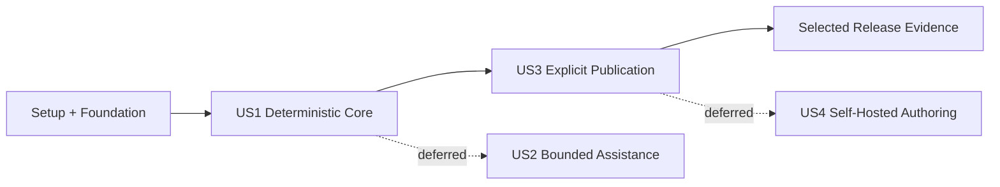

# Tasks: Qava MVP

**Input**: Design documents from `/specs/001-qava-mvp/`

**Prerequisites**: `plan.md`, `spec.md`, `research.md`, `data-model.md`, `contracts/openapi.yaml`, `quickstart.md`

**Tests**: Contract and integration tests are required at schema, mapping, component compatibility, projection, health, publication, concurrency, and immutable-version boundaries. Tests appear before the implementation they validate.

**Organization**: Tasks are grouped by user story. Each phase ends with an independently testable product increment. Tasks intentionally exclude generic plugin systems, extra adapters, multi-tenant infrastructure, event sourcing, WebSockets, and deployment orchestration.

## Format: `[ID] [P?] [Story] Description`

- **[P]**: Can run in parallel because it changes different files and has no dependency on another incomplete task in the phase
- **[Story]**: User story served by the task
- Every task names its primary file path

## Lifecycle Status

Lifecycle tags apply only to unchecked work and express the current value decision:

- **[NOW]**: Required for the first coherent deterministic product loop.
- **[NEXT]**: Required for the selected MVP after the deterministic loop proves useful.
- **[RELEASE]**: Production-readiness evidence; execute after selected product behavior works.
- **[DEFER]**: Valid concept, but its cost or learning value does not justify current implementation.
- **[MERGED->Txxx]**: Preserve the outcome inside the named owning task; do not execute separately.

**Selected path**: deterministic contract-to-live-result -> explicit publication -> release evidence.
Bounded assistance and self-hosted authoring remain documented options, not current commitments.

**Budget checkpoint (2026-07-26)**: the deterministic contract-to-live-result loop is the shipped
prototype boundary. Publication, assistance, self-hosted authoring, and release hardening remain
documented but have no immediate implementation commitment. There are no unchecked NOW or NEXT
tasks after the deterministic browser journey passes.

### Current Value Decision

- Finish the generic deterministic interview and result workspace first; it is the shortest path to proving Qava's core claim.
- Complete author-facing draft review and explicit JSON publication next; these close the constitutional contract-to-publication loop after capture is proven.
- Promote bounded assistance only when observed deterministic interviews reveal a measurable ordering, clarification, or extraction problem.
- Promote self-hosted authoring only after repeated real questionnaire work demonstrates that guided meta-authoring is cheaper than the existing contract and CLI path.
- Run release evidence after selected behavior is stable. Merged tasks are marked complete with their owner once their stated outcome is validated.
- The selected release is complete when all NOW, NEXT, RELEASE, and merged outcomes are complete; DEFER tasks are excluded until explicitly promoted.

## Phase 1: Setup

**Purpose**: Create only the backend, frontend, and test tooling required by the selected stack.

- [X] T001 Create the Python 3.12 FastAPI project and locked runtime/dev dependencies in `backend/pyproject.toml`
- [X] T002 [P] Create the Vue 3.5 TypeScript Vite project and scripts in `frontend/package.json`
- [X] T003 [P] Configure Vue, TypeScript, Vitest, ESLint, and the `/api` development proxy in `frontend/vite.config.ts`, `frontend/tsconfig.json`, `frontend/vitest.config.ts`, and `frontend/eslint.config.js`
- [X] T004 [P] Configure Playwright desktop, mobile, and reduced-motion projects in `./playwright.config.ts`
- [X] T005 [P] Configure Ruff, Pyright, and pytest defaults in `backend/pyproject.toml`
- [X] T006 Create the backend package entry points and lifespan-managed FastAPI application in `backend/src/qava/__init__.py` and `backend/src/qava/main.py`
- [X] T007 [P] Create the Vue application entry point and empty router shell in `frontend/src/main.ts`, `frontend/src/App.vue`, and `frontend/src/router/index.ts`
- [X] T008 Add safe local defaults, `.local/` exclusions, and documented environment variables in `.env.example` and `.gitignore`

**Checkpoint**: Backend and frontend start, and empty lint/type/test commands execute.

---

## Phase 2: Foundational Contracts and Infrastructure

**Purpose**: Establish the shared contracts, persistence, identity, and generated API client that block every user story.

**CRITICAL**: No user-story implementation starts until this phase passes.

### Required Boundary Tests

- [X] T009 [P] Add contract tests for all schemas, catalog entries, definition packs, and examples under `backend/tests/contract/test_data_contracts.py`
- [X] T010 [P] Add tests for immutable questionnaire versions and revision compare-and-swap persistence in `backend/tests/integration/test_repository_invariants.py`
- [X] T011 [P] Add identity parsing and role enforcement tests for author, respondent, and publisher permissions in `backend/tests/unit/test_identity.py`

### Implementation

- [X] T012 Align the v1 definition, question, interaction, session, and insight schemas with the ratified model in `data/contracts/v1/definition.schema.json`, `data/contracts/v1/question.schema.json`, `data/contracts/v1/interaction.schema.json`, `data/contracts/v1/session.schema.json`, and `data/contracts/v1/insight.schema.json`
- [X] T013 Align the built-in component catalog and custom-home examples with stable IDs, `validity` health, readiness, and provenance in `data/components/catalog.v1.json` and `data/examples/custom-home-intake/`
- [X] T014 Implement the local Draft 2020-12 schema registry, strict validation, and the `qava contracts validate` command in `backend/src/qava/infrastructure/contracts/registry.py` and `backend/src/qava/cli.py`
- [X] T015 Define shared typed IDs, problem details, policies, questionnaire, session, interaction, health, and publication records in `backend/src/qava/domain/models.py`
- [X] T016 Create the six-table initial SQLite schema and indexes in `backend/migrations/versions/0001_initial.py`
- [X] T017 Implement async SQLAlchemy setup, WAL configuration, and transaction lifecycle in `backend/src/qava/infrastructure/database/session.py`
- [X] T018 Implement draft, questionnaire, session, interaction, assistance, and publication repository protocols in `backend/src/qava/ports/repositories.py`
- [X] T019 Implement the SQLite repositories with immutable inserts and atomic expected-revision updates in `backend/src/qava/infrastructure/database/repositories.py`
- [X] T020 Implement trusted `X-Qava-Identity` parsing and Qava role dependencies in `backend/src/qava/api/dependencies.py`
- [X] T021 Implement consistent RFC problem-detail mapping for validation, forbidden, not-found, precondition, and conflict errors in `backend/src/qava/api/errors.py`
- [X] T022 Implement environment settings for SQLite, artifacts, identity trust, limits, and assistance mode in `backend/src/qava/config.py`
- [X] T023 Validate `specs/001-qava-mvp/contracts/openapi.yaml`, expose matching FastAPI OpenAPI metadata, and add export tooling in `backend/tests/contract/test_openapi.py` and `backend/src/qava/cli.py`
- [X] T024 Generate the TypeScript API client from OpenAPI and wrap problem responses in `frontend/src/api/generated/` and `frontend/src/api/client.ts`

**Checkpoint**: Contracts and fixtures validate, migrations apply, permission tests pass, and generated client types match OpenAPI.

---

## Phase 3: User Story 1 - Produce a Live Result from an Output Contract (Priority: P1) MVP

**Goal**: An author can compile and publish a questionnaire, and a respondent can answer, edit, resume, navigate, and see the complete canonical result update through a generic Vue client with assistance disabled.

**Independent Test**: Publish the custom-home contract, start a session, answer scalar/choice/conditional/collection/dynamic-option questions, edit an earlier answer, reload, and verify the exact questionnaire version, next interaction, typed result, provenance, health, and revision remain correct, including deterministic fallback when a named option provider is unavailable.

### Required Boundary Tests

- [X] T025 [P] [US1] Add output-need derivation and publication-gate tests for valid and invalid contracts in `backend/tests/unit/test_definition.py`
- [X] T026 [P] [US1] Add strict answer, stable choice ID, condition, and component compatibility tests in `backend/tests/unit/test_answer_and_components.py`
- [X] T027 [P] [US1] Add direct/compose projection, changed-path, inactive-answer, and provenance tests in `backend/tests/unit/test_projection.py`
- [X] T028 [P] [US1] Add deterministic eligibility and ordering tests for required, invalid, review, clarification, and optional interactions in `backend/tests/unit/test_selection.py`
- [X] T029 [P] [US1] Add tests for all five health dimensions, weight normalization, evidence-linked attention, blocking requirements, and deterministic readiness in `backend/tests/unit/test_health.py`
- [X] T030 [P] [US1] Add author-role allow/deny and publication immutability tests for draft create/update/validate/publish APIs in `backend/tests/integration/test_authoring_workflow.py`
- [X] T031 [P] [US1] Add respondent-role allow/deny, session create/resume/answer/edit/skip/navigation, and stale-write API tests in `backend/tests/integration/test_interview_workflow.py`
- [X] T032 [P] [US1] Add semantic renderer compatibility and stable machine-value tests in `frontend/tests/component/SemanticRenderer.spec.ts`
- [X] T033 [P] [US1] Add complete-session replacement and stale-revision recovery tests in `frontend/tests/unit/session.store.spec.ts`
- [X] T034 [P] [US1] Add a self-seeding deterministic end-to-end interview covering first answer, full-result preview, readiness, revision replacement, resume, desktop/mobile composition, and reduced motion in `frontend/e2e/tests/deterministic-interview.spec.ts`; retain dynamic fallback, correction, and transition internals at component/integration test layers

### Domain and Application Implementation

- [X] T035 [P] [US1] Implement output-need derivation, draft compilation, and publication validation in `backend/src/qava/domain/definition.py`
- [X] T036 [P] [US1] Implement strict `equals`, `contains`, and `exists` applicability evaluation in `backend/src/qava/domain/conditions.py`
- [X] T037 [P] [US1] Implement catalog compatibility, deterministic inference, override precedence, and explicit fallback resolution in `backend/src/qava/domain/components.py`
- [X] T038 [P] [US1] Implement strict answer validation and stable choice ID enforcement in `backend/src/qava/domain/answers.py`
- [X] T039 [P] [US1] Implement direct/compose projection, inactive-answer removal, changed JSON Pointers, and provenance in `backend/src/qava/domain/projection.py`
- [X] T040 [P] [US1] Implement all five weighted health dimensions, evidence-linked attention items, and deterministic readiness gates in `backend/src/qava/domain/health.py`
- [X] T041 [P] [US1] Implement deterministic eligible-set creation and tie-broken interaction ordering in `backend/src/qava/domain/selection.py`
- [X] T042 [US1] Implement draft create, update, validate, and immutable questionnaire publication transactions in `backend/src/qava/application/authoring.py`
- [X] T043 [US1] Implement session creation, complete-view assembly, declared named-option lookup with stable IDs and labels, unavailable-provider fallback, answer/edit/skip/navigation mutations, audit interactions, and resume in `backend/src/qava/application/interviewing.py`
- [X] T044 [P] [US1] Expose draft and published-questionnaire operations from the OpenAPI contract in `backend/src/qava/api/routers/questionnaires.py`
- [X] T045 [P] [US1] Expose session create/read, answer, skip, and navigation operations with the canonical result embedded in `SessionView` from the OpenAPI contract in `backend/src/qava/api/routers/sessions.py`
- [X] T046 [US1] Add deterministic v1 definition-pack compilation plus definition publish and session create CLI commands for the custom-home fixture in `backend/src/qava/infrastructure/contracts/definition_pack.py` and `backend/src/qava/cli.py`

### Vue Implementation

- [X] T047 [P] [US1] Implement Qava Cirrus tokens, typography, atmosphere, focus, status, and reduced-motion rules in `frontend/src/assets/tokens.css` and `frontend/src/assets/main.css`
- [X] T048 [P] [US1] Implement readonly identity and authoritative session stores with complete-response replacement in `frontend/src/stores/identity.ts` and `frontend/src/stores/session.ts`
- [X] T049 [P] [US1] Implement route loading, answer/skip/navigation actions, and stale-state refresh in `frontend/src/composables/useSession.ts`
- [X] T050 [P] [US1] Implement primitive boolean, text, number, date/time, and single/multi-choice renderers in `frontend/src/components/renderers/BooleanField.vue`, `frontend/src/components/renderers/TextField.vue`, `frontend/src/components/renderers/NumberField.vue`, `frontend/src/components/renderers/DateTimeField.vue`, and `frontend/src/components/renderers/ChoiceField.vue`
- [X] T051 [P] [US1] Implement money, address, structured form, repeatable group, and file-reference renderers in `frontend/src/components/renderers/MoneyField.vue`, `frontend/src/components/renderers/AddressField.vue`, `frontend/src/components/renderers/StructuredForm.vue`, `frontend/src/components/renderers/RepeatableGroup.vue`, and `frontend/src/components/renderers/FileReferenceField.vue`
- [X] T052 [US1] Implement typed renderer registry resolution and explicit unsupported-component behavior in `frontend/src/components/renderers/registry.ts` and `frontend/src/components/interview/SemanticRenderer.vue`
- [X] [MERGED->T057] T053 [P] [US1] Implement keyed out-in question transitions and reduced-motion direction handling in `frontend/src/composables/useQuestionMotion.ts` and `frontend/src/components/interview/QuestionStage.vue`
- [X] T054 [P] [US1] Implement full tree/raw JSON preview, copy/download, pointer selection, provenance, and 650ms changed-path indication in `frontend/src/components/result/ResultWorkspace.vue` and `frontend/src/components/result/JsonTree.vue`
- [X] [MERGED->T057] T055 [P] [US1] Implement global requirement progress, active topic, revision, readiness, and unresolved-need navigation in `frontend/src/components/interview/SessionRail.vue`
- [X] [MERGED->T057] T056 [P] [US1] Implement the five-dimension health summary and evidence-linked attention display in `frontend/src/components/health/HealthPanel.vue`
- [X] [NOW] T057 [US1] Compose the desktop split workspace and mobile `Question | Result | Health` views in `frontend/src/views/InterviewView.vue`
- [ ] [DEFER] T058 [P] [US1] Implement draft state, explicit author decisions, validation issues, and immutable publish action in `frontend/src/stores/draft.ts`, `frontend/src/composables/useDraft.ts`, and `frontend/src/components/authoring/DraftDecisionList.vue`
- [ ] [DEFER] T059 [US1] Compose contract input, draft decisions, questionnaire preview, publication gate, and typed authoring route with role metadata in `frontend/src/views/AuthoringView.vue` and `frontend/src/router/index.ts`
- [X] T060 [US1] Add typed session routes with respondent-role metadata and same-route parameter reload behavior in `frontend/src/router/index.ts`

**Checkpoint**: User Story 1 works end to end with assistance disabled and no questionnaire-specific client logic.

---

## Phase 4: User Story 2 - Improve the Interview with Bounded Assistance (Priority: P2)

**Goal**: Valid assistance may propose, rank, clarify, and extract only within published policy; invalid or unavailable assistance always falls back to the deterministic US1 flow.

**Independent Test**: Run one questionnaire using valid fixture assistance, timeout, malformed output, undeclared IDs, prohibited operation, and disabled assistance; all runs complete without answer corruption and only valid in-policy runs alter ordering or add persisted clarification/confirmation interactions.

### Required Boundary Tests

- [ ] [DEFER] T061 [P] [US2] Add assistance protocol, discriminated payload, policy-limit, and undeclared-ID validation tests in `backend/tests/unit/test_assistance.py`
- [ ] [DEFER] T062 [P] [US2] Add valid, timeout, malformed, prohibited, clarification, extraction-confirmation, and deterministic-fallback integration tests in `backend/tests/integration/test_assisted_interview.py`
- [ ] [DEFER] T063 [P] [US2] Add clarification and extraction-confirmation rendering tests in `frontend/tests/component/AssistedInteraction.spec.ts`

### Implementation

- [ ] [DEFER] T064 [P] [US2] Define the narrow typed assistance protocol and operation payloads in `backend/src/qava/ports/assistance.py`
- [ ] [DEFER] T065 [US2] Implement disabled and deterministic fixture assistance providers in `backend/src/qava/infrastructure/assistance/disabled.py` and `backend/src/qava/infrastructure/assistance/fixture.py`
- [ ] [DEFER] T066 [US2] Implement policy enforcement, schema validation, proposal persistence, timeout handling, and fallback orchestration in `backend/src/qava/application/assistance.py`
- [ ] [DEFER] T067 [US2] Integrate bounded ranking, persisted clarifications, reviews, and extraction confirmations into interview selection in `backend/src/qava/application/interviewing.py`
- [ ] [DEFER] T068 [US2] Select the disabled or fixture assistance provider from validated application settings in `backend/src/qava/main.py`
- [ ] [DEFER] T069 [US2] Render reason, evidence, policy context, and accept/reject controls for clarification and confirmation interactions in `frontend/src/components/interview/AssistedInteraction.vue`

**Checkpoint**: Assistance improves eligible interactions when valid and cannot change contracts, accept answers, invent fields, or block deterministic completion.

---

## Phase 5: User Story 3 - Understand Readiness and Publish Explicitly (Priority: P3)

**Goal**: Every revision has explainable fitness, and an authorized operator can preview and idempotently publish one exact ready revision while deletion leaves external artifacts intact.

**Independent Test**: Move a session through not-ready, needs-attention, ready, succeeded, failed, outcome-unknown, unauthorized, duplicate-idempotency, and confirmed-deletion cases; verify attention evidence, receipts, artifact count, and retained external output.

### Required Boundary Tests

- [ ] [DEFER] T070 [P] [US3] Verify publication eligibility uses the health assessment from the exact requested revision and cannot be overridden by the headline score in `backend/tests/unit/test_health_readiness.py`
- [ ] [DEFER] T071 [P] [US3] Add JSON adapter validation, side-effect-free preview, exact-revision, idempotency, and outcome-state tests in `backend/tests/integration/test_publication.py`
- [ ] [DEFER] T072 [P] [US3] Add publisher-role allow/deny tests for publication, respondent-role allow/deny tests for session deletion, and verify session-scoped records persist until confirmed deletion, are then removed, and leave external artifacts unchanged in `backend/tests/integration/test_publication_authorization.py`
- [ ] [DEFER] T073 [P] [US3] Add publication review, readiness, receipt, warning, and retry UI tests in `frontend/tests/component/PublicationReview.spec.ts`
- [ ] [DEFER] T074 [P] [US3] Add end-to-end preview/publish/idempotency/deletion tests in `e2e/tests/publication.spec.ts`

### Implementation

- [ ] [DEFER] T075 [US3] Apply the exact revision's existing health assessment and blocking attention items to publication eligibility in `backend/src/qava/application/publishing.py`
- [ ] [DEFER] T076 [P] [US3] Define the minimal validate/preview/publish output adapter protocol in `backend/src/qava/ports/output_adapter.py`
- [ ] [DEFER] T077 [US3] Implement approved-root JSON document validation, preview, atomic publish, content hash, and immutable artifact receipt in `backend/src/qava/infrastructure/adapters/json_document.py`
- [ ] [DEFER] T078 [US3] Implement exact-revision preview, authorized idempotent publication, receipt states, outcome-unknown handling, and confirmed session deletion in `backend/src/qava/application/publishing.py`
- [ ] [DEFER] T079 [US3] Expose publication preview and publish operations plus confirmed session deletion from the OpenAPI contract in `backend/src/qava/api/routers/publications.py` and `backend/src/qava/api/routers/sessions.py`
- [ ] [DEFER] T080 [US3] Implement exact-revision preview, explicit publish, receipt, failure, and external-artifact warning UI in `frontend/src/components/publication/PublicationReview.vue`
- [ ] [MERGED->T080] T081 [US3] Integrate readiness actions and publication review without making publish the default interview action in `frontend/src/views/InterviewView.vue`

**Checkpoint**: Health is explainable, publication is always explicit and idempotent, and local deletion never retracts a published artifact.

---

## Phase 6: User Story 4 - Author Qava Questionnaires with Qava (Priority: P4)

**Goal**: The published-questionnaire schema can drive a guided meta-interview whose result publishes through the same validation gate, with a raw JSON escape hatch.

**Independent Test**: Use the meta-questionnaire to author a five-question questionnaire with choices and a collection, resolve validation issues, publish it to the registry, and run a respondent session against the returned version within 15 minutes.

### Required Boundary Tests

- [ ] [DEFER] T082 [P] [US4] Add questionnaire-registry adapter immutability and version-increment tests in `backend/tests/integration/test_questionnaire_registry.py`
- [ ] [DEFER] T083 [P] [US4] Add meta-questionnaire collection-depth, dynamic catalog choice, cross-reference, and raw JSON gate tests in `backend/tests/contract/test_meta_questionnaire.py`
- [ ] [DEFER] T084 [P] [US4] Add guided and raw self-hosted authoring end-to-end tests in `e2e/tests/self_hosted_authoring.spec.ts`

### Implementation

- [ ] [DEFER] T085 [US4] Publish the canonical questionnaire schema and bootstrap meta-questionnaire definition in `data/contracts/v1/published-questionnaire.schema.json` and `data/definitions/qava-authoring/v1/`
- [ ] [DEFER] T086 [US4] Register the live component catalog as a named provider using the option lookup established in US1 in `backend/src/qava/application/options.py`
- [ ] [DEFER] T087 [US4] Implement immutable questionnaire registry validation and publish behavior in `backend/src/qava/infrastructure/adapters/questionnaire_registry.py`
- [ ] [DEFER] T088 [US4] Connect the registry adapter to meta-session publication and return `{id, version}` receipts in `backend/src/qava/application/publishing.py`
- [ ] [DEFER] T089 [US4] Implement guided meta-authoring collection controls, live catalog choices, cross-reference attention, and raw JSON submission in `frontend/src/views/AuthoringView.vue`

**Checkpoint**: Qava can author, validate, publish, and run a new Qava questionnaire through its own engine.

---

## Phase 7: Acceptance and Cross-Cutting Hardening

**Purpose**: Prove the declared MVP qualities without adding new product surface.

- [ ] [RELEASE] T090 [P] Add the 100-active-session latency and stale-write acceptance runner in `backend/tests/performance/run_session_load.py`
- [ ] [RELEASE] T091 [P] Add keyboard, 200% zoom, desktop/mobile overflow, full-preview, reduced-motion, and status accessibility checks in `e2e/tests/accessibility-and-layout.spec.ts`
- [ ] [MERGED->T091] T092 [P] Add Cirrus workspace screenshots and nonblank/overlap assertions for desktop and mobile in `e2e/tests/visual.spec.ts`
- [ ] [RELEASE] T093 Add the single-worker production container and static Vue serving configuration in `./Dockerfile`
- [ ] [RELEASE] T094 Add contract, backend, frontend, end-to-end, and OpenAPI lint gates in `.github/workflows/ci.yml`
- [ ] [RELEASE] T095 Validate every command and deterministic demo step from `specs/001-qava-mvp/quickstart.md` against a clean checkout and update only incorrect commands in `specs/001-qava-mvp/quickstart.md`
- [ ] [MERGED->T095] T096 Record SC-001 through SC-014 acceptance evidence and final constitution gate results in `specs/001-qava-mvp/acceptance.md`

**Checkpoint**: The selected release passes contract, deterministic behavior, accessibility, visual, concurrency, and publication acceptance gates.

---

## Dependencies and Execution Order

### Phase Dependencies

- **Phase 1 Setup**: Starts immediately.
- **Phase 2 Foundation**: Depends on Phase 1 and blocks all user stories.
- **Phase 3 US1**: Depends on Phase 2 and is the first usable deterministic product.
- **Phase 4 US2**: Deferred; if promoted, it depends on US1's deterministic eligible-set and session workflow.
- **Phase 5 US3**: Follows the deterministic US1 checkpoint and closes the selected publication loop.
- **Phase 6 US4**: Deferred; if promoted, it depends on US1 authoring/runtime and US3's registry publication pattern.
- **Phase 7 Acceptance**: Depends only on selected `NOW` and `NEXT` work.

### User Story Dependencies


### Within Each User Story

1. Add the listed boundary tests and verify they fail for the missing behavior.
2. Implement pure domain behavior before application orchestration.
3. Implement repositories/adapters only when the story uses them.
4. Expose the API after the application use case is complete.
5. Implement the Vue store/composable before composing the route view.
6. Run the story's unit, contract, integration, component, and end-to-end checks before the checkpoint.

## Parallel Opportunities

- In Setup, T002-T005 can proceed after T001's directory convention is known; T007 is independent of backend T006.
- In Foundation, T009-T011 are independent tests; T016, T018, T020-T022 can proceed in separate files after T015 establishes shared types.
- In US1, domain test tasks T025-T029 and UI tests T032-T034 are parallel. Domain implementations T035-T041 are parallel after shared models exist. Renderer groups T050 and T051 can be implemented in parallel.
- US3 begins after the deterministic US1 checkpoint; US2 and US4 have no current execution allocation.
- If US4 is promoted later, T086 and T087 are parallel after the meta contract T085 exists.
- Release tasks T090-T095 are independent after selected story checkpoints pass, except merged outcomes follow their owner.

## Parallel Example: User Story 1

```text
Task T025: Add definition and publication-gate tests.
Task T026: Add answer, condition, and component tests.
Task T027: Add projection and provenance tests.
Task T028: Add deterministic selection tests.
Task T029: Add health/readiness tests.
Task T032: Add semantic renderer tests.
Task T033: Add session-store tests.
```

After those tests fail for the intended missing behavior:

```text
Task T035: Implement definition compilation.
Task T036: Implement conditions.
Task T037: Implement component resolution.
Task T038: Implement answer validation.
Task T039: Implement projection and provenance.
Task T040: Implement complete explainable health and readiness.
Task T041: Implement deterministic selection.
```

## Implementation Strategy

### Fastest Working MVP

1. Execute `NOW` work and its merged outcomes.
2. Run the deterministic custom-home workflow with assistance disabled.
3. Demonstrate typed interview, answer editing, resume, full output preview, health, and stale-write rejection.
4. Execute `NEXT` authoring and explicit-publication work only after that checkpoint is useful.
5. Execute `RELEASE` evidence against the selected behavior.

The deterministic checkpoint is the first usable product and the decision point before external side effects.

### Incremental Delivery

1. **NOW**: Generic contract-to-live-result interview.
2. **NEXT**: Author review plus explainable, explicit publication.
3. **RELEASE**: Capacity, accessibility, visual, container, CI, and demo evidence.
4. **OPTIONAL**: Promote bounded assistance or self-hosted authoring only from observed product need.

### Scope Discipline

- Do not add adapters beyond JSON document and questionnaire registry.
- Do not add a general provider/plugin framework beyond the single assistance protocol.
- Do not add multi-tenancy, built-in credentials, automatic migration, event sourcing, Redis, PostgreSQL, WebSockets, Kubernetes, or continuous destination writes.
- Do not create a standalone design system package; implement only tokens and components used by an MVP screen.
- Prefer direct functions, Pydantic models, focused Vue components, and one authoritative complete session view over configurable abstractions.
